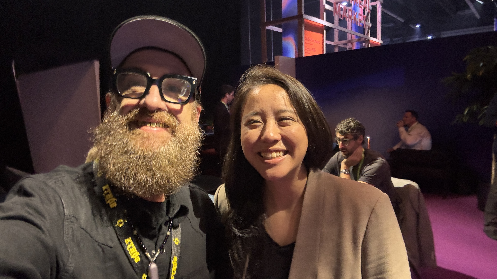
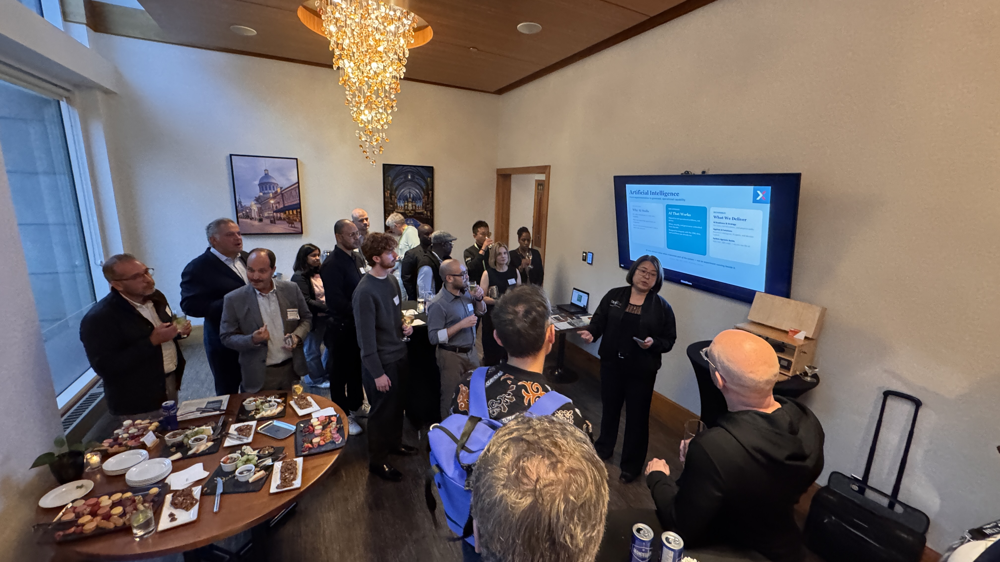

# ALL IN Montréal: a robot walks up to a mirror

*A hotel-bar argument, a roboticist with a difficult question, and an Indigenous technologist who has been doing sovereignty since before it became everybody’s favourite conference word.*

*With Dr. Angelica Lim at ALL IN, September 16. Photograph: Kris Krüg.*

“If I put my world model viewpoint in front of a mirror, what is it going to see?”

Dr. Angelica Lim dropped that into our conversation on Wednesday morning at ALL IN Montréal, and I have been carrying it around ever since.

The country was having a big day. Ministers, cameras, Canada-Germany announcements, enough language about sovereign AI to wallpaper the Palais des congrès. I wanted to hear about all of it. Then a roboticist from SFU handed me a mirror, conceptually speaking, and the whole thing got more interesting.

This is why I come to these things. Somebody who has actually built the machinery asks a question that makes you reconsider what you thought you were looking at.

[Yesterday’s dispatch](https://kriskrug.co/2026/09/15/headed-east-for-all-in-montreal/) followed the conversations that got me east. This one follows the people I found between the announcements: Angelica, David Gratton, the Cordata crew, Jeff Ward and Hanna Demoz. People working on different parts of the same messy question.

What would it take to build an AI future we could actually live in?

## The roboticist brought a mirror

[Angelica Lim](https://www.sfu.ca/fas/computing/people/faculty/faculty-members/angelica-lim.html) leads [SFU’s Rosie Lab](https://www.rosielab.ca/). Robots with Social Intelligence and Empathy. Even the name gets straight to the part I care about: what happens when the machine meets a person.

We started with world models. Angelica brought the term back to something a roboticist could use: a simulation in which you can try an action and see what happens.

“As a roboticist, I’ve been using simulators for 20 years,” she told me. You test in simulation before you break the robot in the real world.

Fair. I would also prefer my expensive robot to discover stairs theoretically before discovering them face-first.

She had worked on Pepper, a robot that encountered people in all their unpredictable complexity. Her question about the new generation of world models was whether they could handle that complexity. Beautiful interiors and static objects only get you so far.

Then the mirror. A viewpoint moves through a generated world, but has the system represented the person supposedly doing the looking? What should appear in the reflection?

She was equally frank about her own field. Roboticists have “janky simulators,” she said: good physics, less convincing appearances. There is useful work for these communities to do together.

That combination gets my attention. She can tell you where the exciting new thing falls short and where her own tools fall short. Now there is somewhere for the conversation to go.

We also talked about her research into interactions with language models, supported by the Canadian AI Safety Institute. She described the aim as understanding “what is happening in our brain when we’re interacting with language models.”

The [Human Line Project](https://thehumanlineproject.org/) came up: people documenting psychological harms associated with AI and supporting those affected. Angelica discussed the term “AI-associated delusions” and the questions researchers are trying to investigate around connection, obsession and losing sleep.

This got uncomfortably close to home. I told her about being introduced to Midjourney, realizing my industry was changing, and going through a stretch of sleeping about two hours a night.

I was describing my experience, not diagnosing myself. But I could recognize the pull. The machine keeps answering. Another idea arrives. You follow it.

I want the creative possibility. I also want people studying what sustained contact with these systems does to us. Angelica is doing that work. I am glad she is in the room.

## Last night, under the chandeliers

The funding argument started the evening before, at the ProjEx social at GaZette in the Westin.

Julie Bui and Arjun Kadaleevanam helped bring the gathering together. There were introductions, food, a presentation screen and a chandelier doing considerably more than the minimum. Maureen Ososo introduced her work with Pioneer House in Nigeria. People had come from different places and found themselves close enough to start comparing notes.

*The ProjEx room at GaZette, September 15. Image supplied by Kris Krüg.*

Credit to Julie and Arjun. People remember a useful conversation as something they happened to stumble into. Somebody made that room possible.

I found myself talking with David Gratton from Norbot, an old ally from the Work at Play days. We have enough shared history to get into an argument without mistaking it for the end of civilization.

Web Summit Vancouver was one of the subjects. David saw a good deal for the local community. I thought we should have put the support into building something homegrown. I came away dictating notes about our disagreement because it was the useful kind: two people who care about the place, arguing over what would help it.

Underneath the event economics was the bigger question. Do you put more innovation money behind established champions, or spread it among people trying to build their first thing?

I know the answer involves both. Then comes the hard part: how much, to whom, and why?

My instinct is to water the saplings. Through Internet Archive Canada’s support and our AI Builders work, I get to help move resources toward people with an idea and something they want to make. That feels good. I want more of it.

A country needs serious research institutions. It also needs ways for a strange little project to survive long enough to become useful. The people capable of surprising us do not all arrive with a grant writer and an existing relationship with the minister’s office.

Some arrive at a meetup carrying a laptop full of half-working shit.

I would like them to have a chance.

## The civic information hiding in plain sight

Later in the ProjEx room, the Cordata Intelligence conversation gave me something concrete to chew on.

The crew described two related pieces of work. One reads published municipal documents, including council minutes and budget statements. Another, Cordata Civic, brings scattered bylaws, services and other municipal resources into a knowledge base that people can ask questions of.

I was already running ahead of the explanation. Journalism. Local records. The things happening in a neighbourhood that nobody has time to pull out of a huge document.

Then they brought me back to accessibility.

A multilingual system could help somebody ask for information in the language they actually speak. The example in our conversation was Tagalog. They also described a phone service, giving people another way in besides a website or a chat window.

That was the interesting bit. Picture the actual person trying to find a service, understand a bylaw or work out what their municipality has decided. How much effort have we made them spend before they can even ask the question?

I have not tested Cordata’s answers. I would want to check accuracy, sources and what happens when it does not know. But I like the problem they have chosen.

The old web taught us how to publish a mountain of information. People are still trying to get through it.

There are builders in these smaller rooms working on that very ordinary, very consequential problem. I want to keep finding them.

## The big announcement gets its paragraph

Wednesday brought [Cohere’s definitive agreement to combine with Aleph Alpha](https://cohere.com/blog/cohere-and-aleph-alpha-sign-agreement) and [LawZero’s announcement of up to C$300 million in funding committed by Canada and Germany](https://lawzero.org/en/news/lawzero-receives-commitment-300m-joint-funding-canada-and-germany). Big moves. The signed agreement and funding commitment are real; the resulting technology and its benefits still have to be delivered. I watched the cameras gather and kept wondering how the work on those stages would connect with the people I was meeting elsewhere.

*The press pen at ALL IN, September 16. Photograph: Kris Krüg.*

## Jeff Ward has been doing sovereignty for a while

Lunch with [Jeff Ward](https://animikii.com/about/jeff-ward) brought the word sovereignty down to the size of a room.

Jeff founded Animikii in 2003. He is Ojibwe and Métis, based in Victoria on Lekwungen territory, and has spent years building technology with Indigenous communities. While Canada is discovering how uncomfortable dependence can feel, people like Jeff have been thinking about control over their own information for a long time.

What was getting him excited now? Local models. Local agents. Compute moving back onto people’s own devices.

His point was practical: as smaller models improve, more everyday tasks could happen locally. You would still need substantial compute for some work, but the useful daily stuff might run where the person and their information already are.

My brain immediately went there. What if a middle power’s AI ambition included making it possible to do useful work inside your own four walls?

Jeff’s [Niiwin platform](https://niiwin.app/) lets people design and govern their data, control access, and choose where to host it. In our conversation, he offered the developer shorthand “Indigenous-owned Firebase,” while warning that he was oversimplifying.

The part I care about is who gets to decide. A community can have reasons for keeping particular knowledge close. The people responsible for that knowledge should be able to carry those decisions into the software.

I put it to him this way: Canada is having problems with its downstairs neighbour, and here are Indigenous technologists who have been working out how to protect their own knowledge and build for their own people. There may be something the country could learn by listening.

Then our conversation turned toward recording. Which was particularly relevant because I was sitting there with a recorder.

Jeff described software-design meetings that can include elders and residential school survivors. Somebody begins sharing a story, and the meeting changes. You stop and listen. He said they commonly leave the recording function off. When recording is appropriate, they get consent, use local transcription and explain what the notes are for. Summaries can be made with local models too.

That is a concrete account of care. It reaches all the way down to the software setting.

I spend a lot of my life recording, transcribing and making connections across material. Jeff was showing me where his practice puts boundaries around that machinery. I want to learn from that.

He also caught me reaching for an easy story about clean hydropower. I was imagining Indigenous-owned computing infrastructure. He reminded me that hydro has its own difficult history with First Nations.

Fair correction. Calling the electricity green does not settle what happened to the river or who had a say. I need to carry that into the next version of my pitch.

And then he told me about the names.

Animikii. Niiwin. For years, customers and officials have been learning to say them. Jeff described it as his “tricky way to get everyone to speak Ojibwe.”

I love that. Language activism in the product meeting. You want the software? Start by learning the word.

We talked about the language rules we give our own AI tools and agreed to swap material. His line: “We de-colonize your notecard.”

That one is coming home with me.

Jeff was also making music, deliberately keeping AI out of this particular record. With technology everywhere else in his life, he wanted a creative outlet with different conditions.

A person can build these tools all day and still choose where they belong. I was happy to hear him claim that space for himself.

## Hanna knows what happens after the program ends

By the time I met [Hanna Demoz from Amii](https://www.amii.ca/people/hanna-demoz), I had followed enough cameras around the expo floor. We went looking for somewhere quieter and ended up outside.

Hanna had helped produce the Venture Track at [Upper Bound](https://www.amii.ca/events/upper-bound-2026). She talked about the events around the conference and the people who had flown all the way to Edmonton. They wanted things to do in the evening. They wanted to meet the city and each other.

Immediately familiar territory. The schedule gets them there; somebody still has to think about what happens between the scheduled things.

We talked about Web Summit too. “Everybody’s just trying to sell me something,” she said of the feeling she sometimes had inside. She also saw the value of it drawing people to Vancouver and bringing more attention to the community there.

I could hold both of those thoughts. Getting people together does create something. The question is how much room they have to do something with it.

I told her about our monthly gatherings at the H.R. MacMillan Space Centre, the people forming regional and thematic groups, and the work going into [Futureproof Festival of AI](https://www.futureproof.website/). The story gets longer every time I tell it because more people keep adding to it.

My explicit goal in Montréal was to connect with Amii, Mila and Vector. I want BC builders, artists and teachers to know people inside those institutions. I want invitations, learning opportunities and ideas to travel in both directions.

[Amii’s national AI literacy initiative](https://www.amii.ca/updates-insights/amii-leads-national-ai-literacy-initiative) aims to reach a million learners. Connecting that ambition with people already gathering and teaching in their communities seems like useful work to me.

Hanna talked about Amii’s efforts to spend more time on the West Coast. We had a conversation to keep going. I am not announcing a new institutional partnership from a patch of fresh air outside the Palais. I am glad we made the introduction.

Also, a field note: Vector had very good little pouches. At the time I recorded my assessment, Mistral had the best swag.

I contain multitudes. Some of them want socks.

## Back toward the street

Before any of these Wednesday conversations, I had photographed police vehicles and protest posters near the Palais.

[Canadian Press reported](https://toronto.citynews.ca/2026/09/16/offices-of-montreal-based-artificial-intelligence-institute-vandalized-one-arrested/) that police were investigating smashed windows and graffiti at Mila’s offices overnight. Separately, [march organizers called people out against ALL IN](https://www.cobp.resist.ca/en/node/25783?page=6). The reporting does not establish that the march organizers carried out the vandalism.

By midafternoon I was walking back through Square Victoria to recharge before heading out again. That part of the story was still ahead.

For now, I had Angelica’s mirror, David’s argument, Cordata’s phone service, Jeff’s recording boundaries and Hanna’s attention to what happens outside the official program.

A pretty good haul from a day of talking to people.

I want more rooms where those people can find one another. That is what we are making with Futureproof, October 28–30 in Vancouver. [Have a look at the lineup](https://www.futureproof.website/speakers/). [Come join us](https://www.futureproof.website/).

Bring the thing you are building. Bring the awkward question. Bring the experience that makes somebody else reconsider their answer.

I will be there with the recorder, asking first.

## Further down the rabbit hole

- [Rosie Lab](https://www.rosielab.ca/): Angelica’s crew studying robots, people and the difficult business of understanding each other.
- [The Human Line Project](https://thehumanlineproject.org/): follow the human consequences alongside the capabilities.
- [Animikii](https://animikii.com/about/jeff-ward) and [Niiwin](https://niiwin.app/): Indigenous data sovereignty with actual software underneath it.
- [Amii’s national AI literacy initiative](https://www.amii.ca/updates-insights/amii-leads-national-ai-literacy-initiative): the learning effort I want our communities connected to.
- [Futureproof Festival of AI](https://www.futureproof.website/): the Vancouver room we are building together.
- [Post one: Headed East for ALL IN Montréal](https://kriskrug.co/2026/09/15/headed-east-for-all-in-montreal/): how I got here, including the boarding-line incident.
