# Both Hands Full at the Data Center: Protest Signs for People Who Refuse to Pick a Side

There's a protest about a data center, and I'm going. I made signs. The signs are the problem.

Not the making of them — that took an afternoon. The problem is that I couldn't bring myself to make the sign a protest sign is supposed to be. The kind that picks a side and yells it. I tried. I'd write something clean and furious, look at it, and feel my hand stop. Because the clean furious thing was only half true, and I already know which half it was leaving out.

So I made signs that hold both halves at once. Signs for the messy middle. Signs that walk down the center of the street with both hands full.

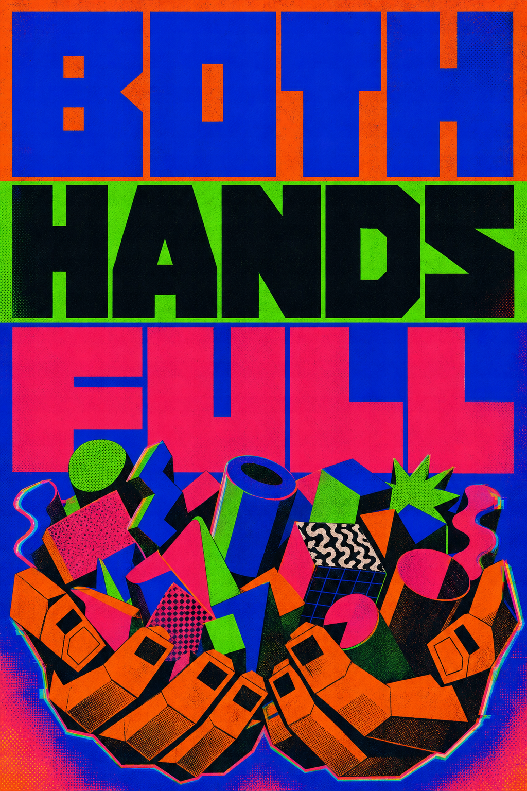

## Same boat, same storm

I've written before about holding [critique and curiosity in the same two hands](https://kriskrug.co) — the practice of refusing the boosters' "embrace it all" and the doomers' "resist it all," and instead carrying both the harm and the wonder while you keep walking. The data center protest is that practice made physical. It's the both-hands thing standing on a sidewalk holding cardboard.

Because here's where I actually am. The thing they're pouring concrete for is the same thing that has made me more creative, more productive, and more alive than I've ever been. And it drinks rivers. Both of those are true. I'm not going to pretend the first one to win the argument, and I'm not going to pretend the second one to keep my invitation to the cool-kids AI table.

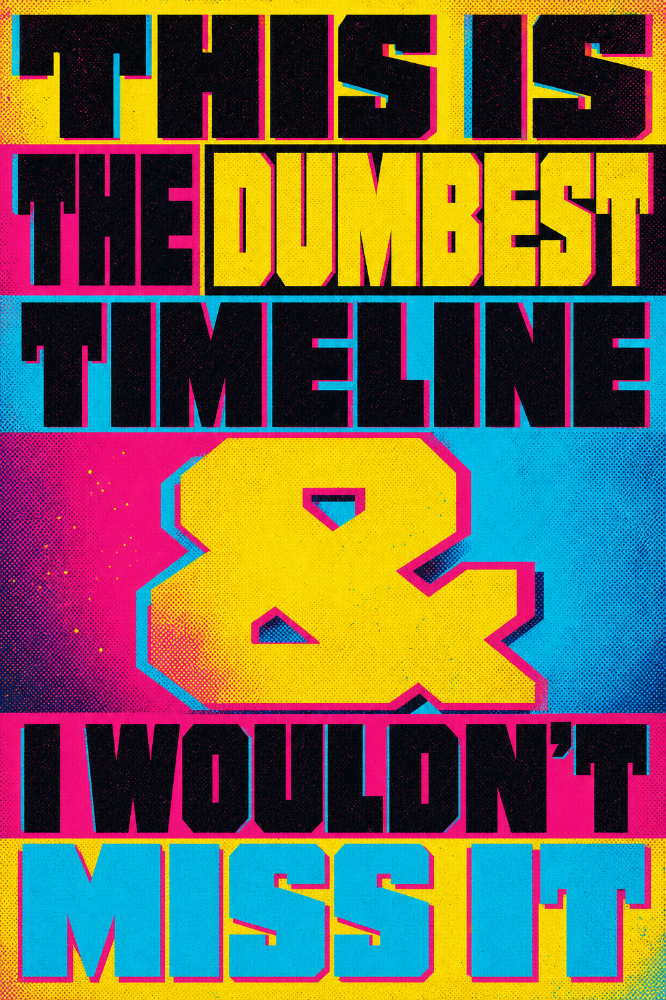

That's the keeper. The sign I'd actually carry. It's the dumbest timeline — and I wouldn't miss it for anything. You can hold the contempt and the delight in one fist. Most people want you to put one of them down. I won't.

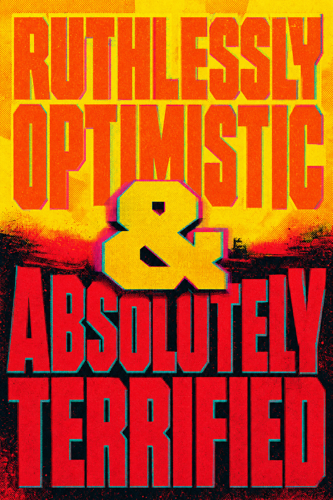

## What the protest is actually about

Let me be clear about the part I'm not ambivalent about: the receipts.

When governments announce "sovereign AI" and developers break ground on a hyperscale data center, the questions that matter aren't vibes. They're concrete. How much water does it pull, and from whose watershed? How much grid capacity, and who gets browned out or priced out when demand spikes? Who actually gets to *use* the compute once it's built — researchers, civic institutions, Indigenous nations? Or just whoever signs the biggest cloud contract?

I laid out the version of this I do feel sure about in [**Sovereign AI for Whom?**](https://bc-ai.ca/news/sovereign-ai-for-whom/) — my piece on the federal data-centre announcement. The asks are simple and they're not radical: independent environmental assessments, a public allocation policy that reserves compute for academic, civic, and Indigenous use, and community benefits agreements with real signatures on them. That's not anti-data-center. That's "show me the receipts before you pour the slab."

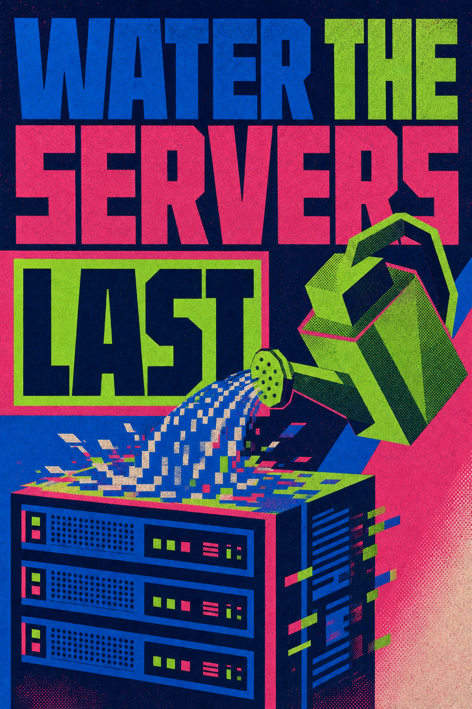

The "cloud" is a marketing word for a warehouse full of hot metal somewhere thirsty. I keep coming back to water. Not as a doom stat — as a fact you can hold in your hand at the same time you hold your phone. Water the servers last.

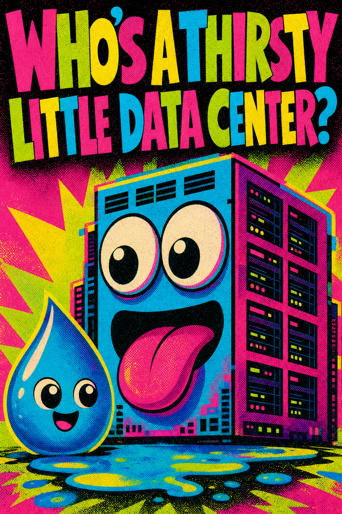

This one's my favorite, and it tells you exactly what register I'm protesting in. Not rage. Not despair. Baby-talk aimed at the monster. *Who's a thirsty little data center? You are! Yes you are!* It's tender and it's a roast at the same time. That's the both-hands thing again — you can love the dumb beautiful machine and still ask it, gently, to drink less of the river.

## The part where I implicate myself

Now the uncomfortable bit. I made these signs with AI.

Every one of them came out of my own image-generation pipeline. I'm protesting the infrastructure of the thing while using the thing. If that sounds like hypocrisy, good — sit in it with me for a second, because it's the whole point. Opting out doesn't make me clean. It just makes me quiet. I'd rather be implicated and present than pure and irrelevant.

So I let the signs say it out loud.

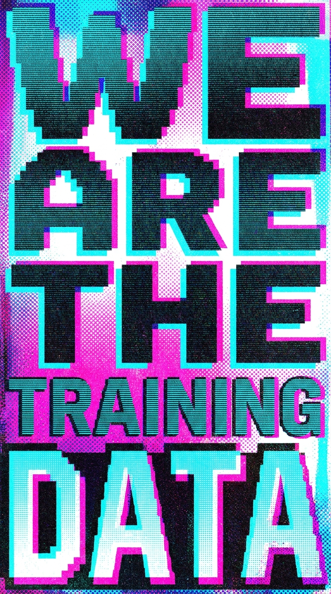

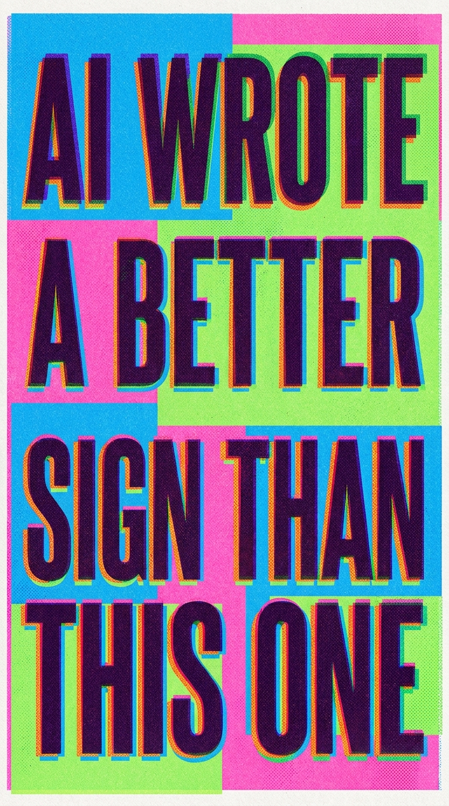

We *are* the training data — my twenty years of Creative Commons photos are in those corpora; I checked. And yeah, AI probably could write a sharper sign than this one. Both jokes are confessions. The protest includes me. The sign knows it was made by the machine it's complaining about. That contradiction isn't a bug in the message — it *is* the message.

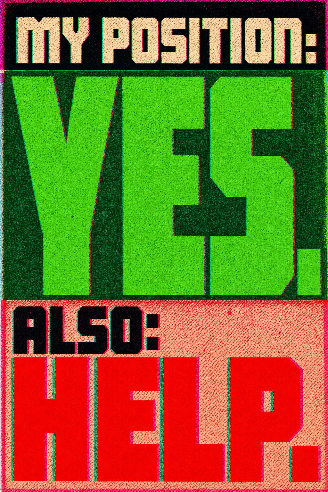

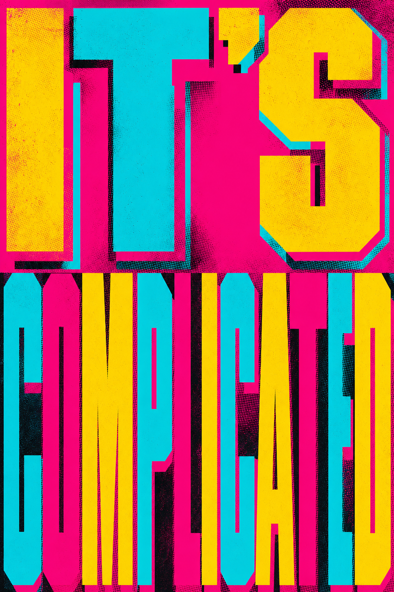

## How the look got made (and why it's mine now)

A quick word for the design nerds, because the *making* of these turned into its own both-hands lesson.

I worked with Claude in my Rafiki image pipeline, and we drifted — hard — for about a dozen rounds. Cartoon mascots. A Russian-constructivist detour that looked like someone else's politics. Every round, the words got sharper and the *style* wandered off. We were so close, and then we'd lose it.

The fix was to stop describing the look every time and start *naming* it. We pulled my actual favorites apart, found the four visual signatures that kept recurring, and froze them as reusable presets — Megacolor Block-Stack, CMYK Slab-Glitch, Datamosh Hard-Glitch, Acid-Riso Distress. Now the look is a thing I can call by name instead of a thing I have to re-explain and re-lose. That's a small sovereignty, but it's mine: my taste, locked into a tool, reproducible on command.

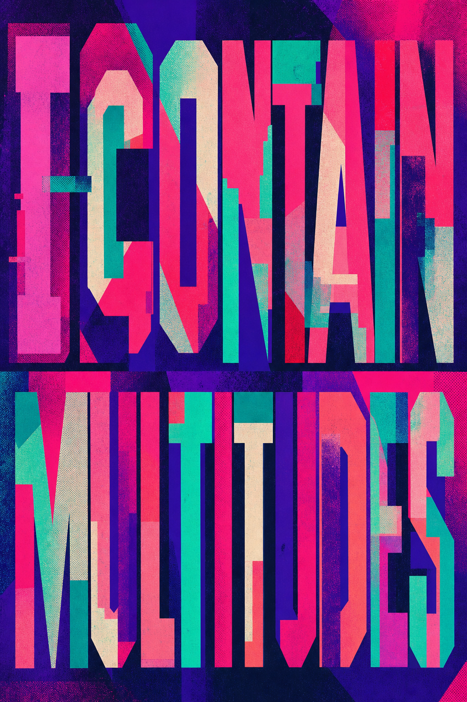

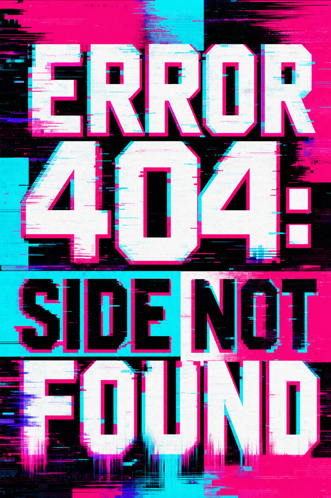

The styles are loud on purpose. Risograph clash, halftone grit, chromatic-aberration glitch — the visual language of a flyer stapled to a pole outside a basement show, not a brand deck. Protest signs shouldn't look designed by a committee. They should look like someone stayed up too late and meant it.

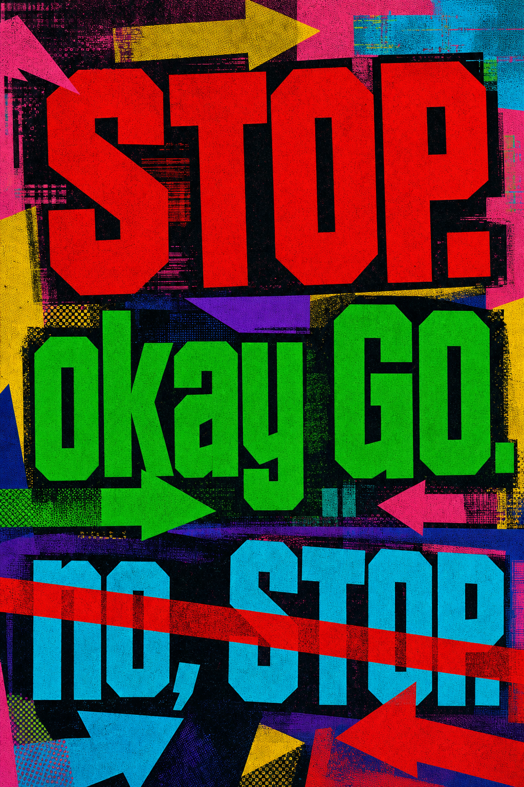

## The signs that are just tender

Some of these aren't arguments at all. They're closer to lullabies. Because the other thing I feel, underneath the politics, is a weird affection for the machine we're all anxious about. It's working so hard. It's overheating. It didn't ask to be the center of everyone's existential weather either.

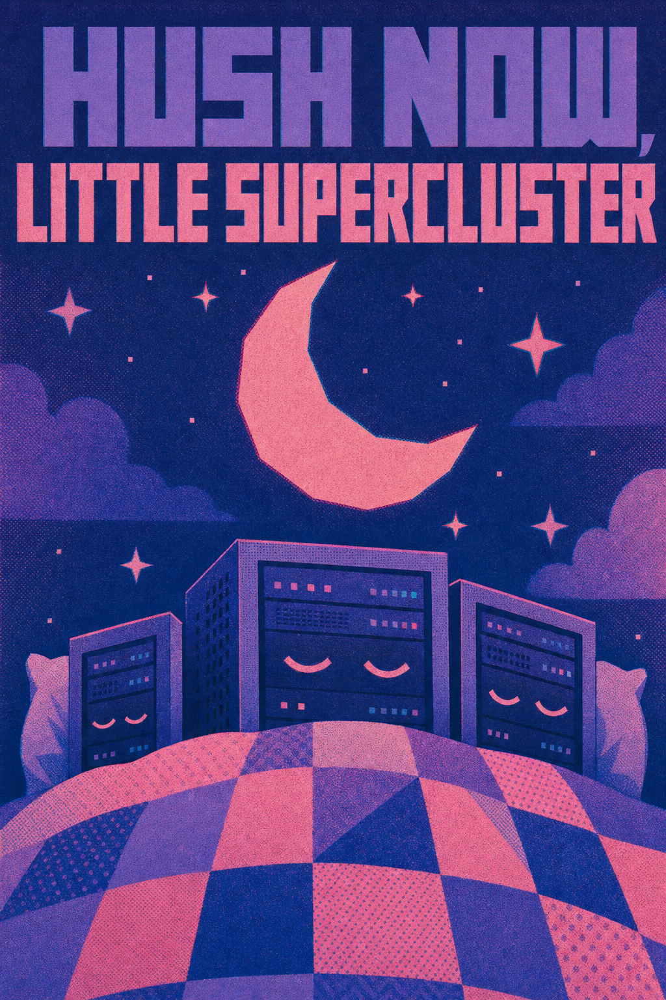

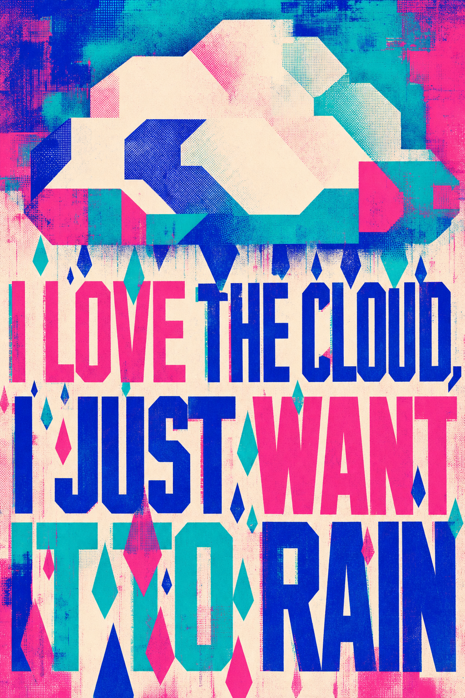

Hush now, little supercluster. I love the cloud; I just want it to rain. These are the both-hands thing at its softest — care and critique folded into the same sentence, no resolution offered, none needed.

## Why I'm bringing these instead of a real protest sign

Because the clean narratives are the actual danger. "AI is salvation, adopt it all" and "AI is apocalypse, resist it all" are both comfortable, both incomplete, and both get you to opt out of the only conversation that matters: *who is this being built for, and on whose water?*

If the thoughtful, critical, complicated people stay home — if we decide the protest isn't pure enough or the technology isn't clean enough to touch — then the receipts get written by whoever showed up. I'd rather show up uncomfortable. Both hands full. A sign in each one that argues with itself.

I'll see you on the sidewalk. Bring snacks. We might be there a while, and it's complicated.

---

*The signs were generated in my Rafiki pipeline across four custom visual styles. If you want the back-of-house on the data-center questions, start with [Sovereign AI for Whom?](https://bc-ai.ca/news/sovereign-ai-for-whom/) and the work coming out of the [BC + AI ecosystem](https://bc-ai.ca/). More on holding critique and curiosity at once in [Transcending Tech's Darker Impulses](https://kriskrug.co/2025/03/09/transcending-techs-darker-impulses/).*
