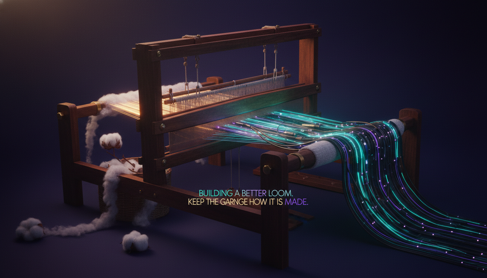

# Cotton Underwear and the AI Guy at the Data Center Protest

Let me tell you a story somebody told me long ago.

Back when I was running around as a climate guy, people loved to point out that I was a hypocrite. I'd be flying somewhere to stand in front of an oil project, phone in my pocket, laptop in my bag, and the line was always the same: "How can you protest extraction when you're standing here typing on a slab of mined cobalt that flew here on jet fuel? You're part of the problem, dude."

It's a good line. It feels like checkmate. It is not checkmate.

Somebody finally handed me the thing that broke the spell. They called it the cotton underwear paradox.

Here's the shape of it. The abolitionists who fought to end slavery wore cotton. Cotton picked by enslaved people. They were inside the system, wearing it on their bodies, benefiting from it every single day, and they were also the ones trying to burn it down. Those two facts sat in the same closet. Not because the abolitionists were frauds, but because there was no clean room to stand in. There was no version of 1840 where you opted out of the cotton economy and waited for a better one to arrive. You used the thing while you fought the thing. That was the only move available to a person who actually wanted it to change.

Being part of a system and critiquing it and reforming it and holding it accountable are not mutually exclusive. They never were. The "you use it so shut up" argument is a trap that only works if you agree to feel ashamed.

I do not agree to feel ashamed.

## So I went to the protest

This week I went to the Vancouver AI data center protest.

And a bunch of people did the thing. "Kris, you're the AI guy. You do rad AI shit all day. How are you out here protesting AI data centers?" Same checkmate face. Same cotton underwear.

Here's my answer, and it's the whole point of this post: I can live in this world. I can use tokens. I can build agents and train models and ship weird beautiful AI projects, and I can still stand on a street corner and say we are not going to do this the Silicon Valley hyperscaler way. We are not going to bulldoze watersheds and triple everyone's hydro bill and call it innovation. We are not going to power the future on extraction and pretend the receipts won't come due.

Underwear is awesome, by the way. Think about life before underwear. Genuinely think about it. We invented underwear and it was a good fucking idea and we should keep going in the underwear direction. What we do not need is slaves to make the underwear. The garment is not the crime. How you make it is the crime.

AI is the underwear. The hyperscaler extraction playbook is the slaves. You can want one and refuse the other. That is not hypocrisy. That is just having two working brain cells at the same time.

## The tinsmith move

There's a piece of internet folklore I keep coming back to.

When Stewart Butterfield left the company he'd helped build, the one that got swallowed by a giant, he didn't write a normal resignation letter. He wrote this rambling, deadpan story about being a tinsmith. An 1800s tinsmith, going on about the dignity of working with tin while the world moved to other metals. It was funny and obscure and it took people a minute to realize it was a resignation. And underneath the bit, it was a real critique of the company he was leaving. He got to say the true thing without torching the bridge. He kept his stock options and his good name and he still landed the punch. People are still talking about that letter.

That's the energy I'm after. I have to critique the government and the establishment and the institutions, hard, because that's the job and because somebody has to. And I also have to keep showing up to the meetings, keep my seat at the table, keep being someone these people will pick up the phone for. Tinsmith mode. Land the punch, keep the relationship.

Because here's the thing nobody at the protest and nobody at the policy table wants to hear from each other: we actually need both rooms. The street corner keeps the table honest. The table is where the street corner's anger turns into a clause in an actual document. If you only ever do one, you're cosplaying. The whole game is being credible in both.

## What I'm actually for

So no, I'm not against the data centers. I'm against the default.

The default is: a handful of trillion-dollar companies decide where the compute lives, who pays for the power, whose water cools the racks, and who never gets asked. The default is move fast, break the earth, externalize the cleanup. The default treats British Columbia like an empty hard drive to write their roadmap onto.

I want the other version. Compute that's accountable to the place it sits in. Power deals that don't quietly land on a single mom's hydro bill. Indigenous governance with real authority, not a land acknowledgment slapped on a press release. Public benefit you can actually point at. A say for the people who live next to the thing.

That version exists. It's harder. It's slower. It doesn't make a 22-year-old a billionaire by Friday. And it's the only one worth building.

So I'll keep doing the rad AI shit. And I'll keep showing up to the protest. And if you want to call that a contradiction, go ahead. I'll be over here in my cotton underwear, building a better loom.

*See you at the table. And on the corner.*
