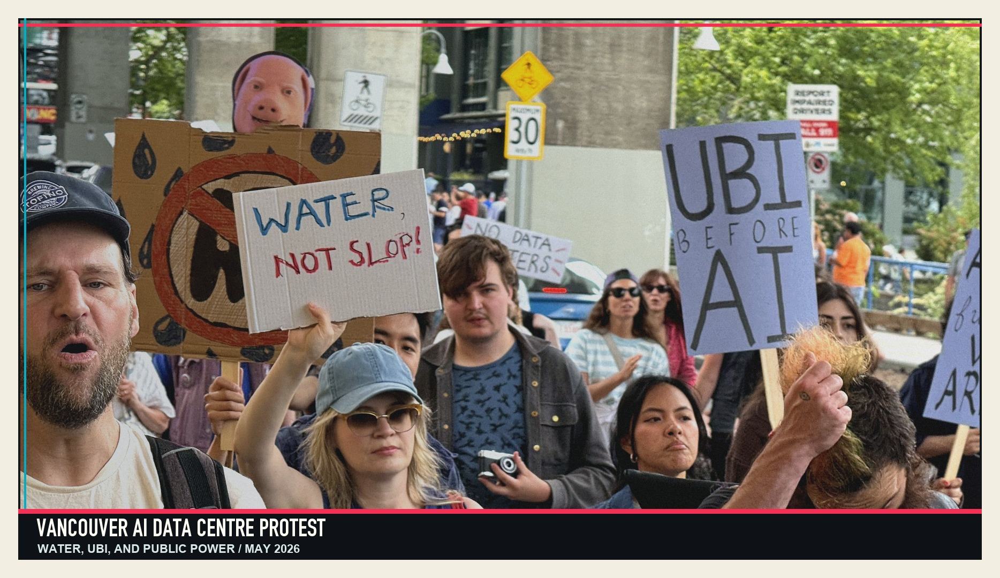
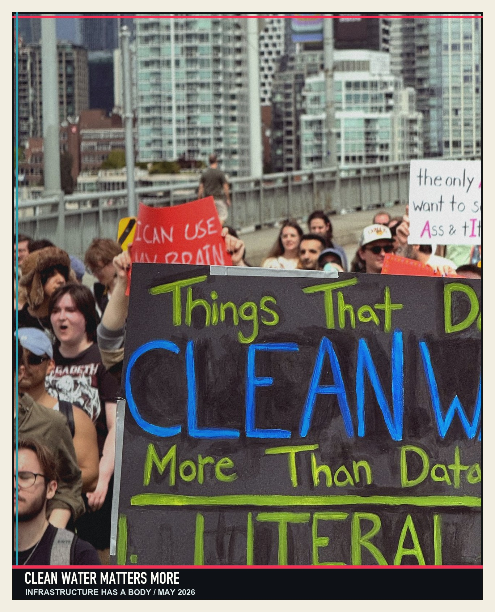
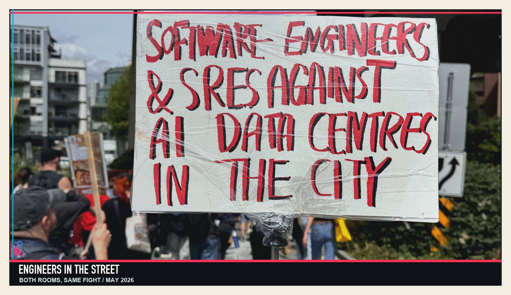
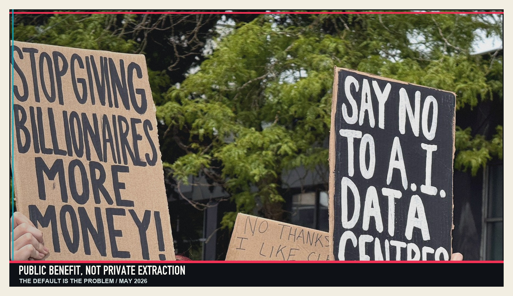

Let me tell you a story somebody told me a long time ago.

Back when I was running around as a climate guy, people loved to point out that I was a hypocrite.

I would be flying somewhere to stand in front of an oil project, phone in my pocket, laptop in my bag, and someone would always arrive with the same smug little argument polished up like a tiny courtroom gavel:

> “How can you protest extraction when you’re standing there with an iPhone, a laptop, and a boarding pass? You’re part of the problem, dude.”

It’s a good line.

It feels like checkmate.

It is not checkmate.

Eventually someone handed me the thing that broke the spell. They called it the cotton underwear paradox.

The shape of it goes like this: abolitionists lived inside economies tangled up with cotton, sugar, shipping, banks, insurance, land, law, empire, and violence. Much of that cotton economy was built on enslaved labour. Some abolitionists wore cotton. Some boycotted slave-grown goods. Some tried to build free-produce alternatives. Some failed to live cleanly inside an unclean system because, shockingly, history did not provide them with a morally sterile panic room.

That does not make the abolitionists frauds.

It makes the world complicated.

The lesson is not that complicity does not matter. It matters enormously. The lesson is that “you touched the system, therefore you may never criticize the system” is a trap. It is a cheap trick dressed up as moral seriousness.

Being part of a system and critiquing it, reforming it, resisting it, and holding it accountable are not mutually exclusive.

They never were.

The “you use it, so shut up” argument only works if you agree to feel ashamed.

I do not agree to feel ashamed.

<!--nextpage-->

## So I went to the protest

This week I went to the [Vancouver AI data centre protest](https://kriskrug.co/2026/05/23/you-cant-drink-data/).

And a bunch of people did the thing.

“Kris, you’re the AI guy. You build agents. You train models. You do rad AI shit all day. How are you out here protesting AI data centres?”

Same checkmate face.

Same cotton underwear.

Here’s my answer, and it is the whole point of this piece:

I can live in this world. I can use tokens. I can build agents and train models and ship weird, beautiful AI projects.

And I can still stand on a street corner and say: we are not going to do this the lazy hyperscaler way.

We are not going to treat electricity as infinite, water as someone else’s problem, communities as background texture, Indigenous governance as a ceremonial paragraph, and public benefit as whatever remains after the deal is already done.

I am not against compute.

I am not against data centres.

I am not against the infrastructure required to make AI useful, sovereign, secure, and available to Canadian researchers, companies, public institutions, artists, educators, and communities.

I am against pretending that infrastructure is neutral.

It is not.

AI is not a ghost in the cloud. AI has a body.

It has substations and cooling systems. It has land use and fibre routes. It has procurement contracts, labour conditions, rate structures, water impacts, diesel backups, heat-recovery promises, grid queues, carbon math, public subsidies, private upside, and political consequences.

In BC, this is not abstract. [BC Hydro is already talking about AI data centres](https://www.bchydro.com/news/press_centre/news_releases/2026/ai-data-centres.html), the Province has an [Industrial Electricity Allocation Framework](https://www2.gov.bc.ca/gov/content/industry/electricity-alternative-energy/electricity/industrial-electricity-allocation-framework), and the federal government is advancing [large-scale sovereign AI infrastructure](https://www.canada.ca/en/innovation-science-economic-development/news/2026/05/government-of-canada-and-telus-advance-work-to-build-sovereign-ai-infrastructure.html) in British Columbia. The paperwork is not separate from the politics. It is where the politics live.

On BC + AI, we made the same case in [BC + AI’s Platform for Canada’s AI Task Force](https://bc-ai.ca/news/bc-ai-s-platform-for-canada-s-ai-task-force/): community compute, climate accounting, and Indigenous data governance have to be design constraints, not garnish.

AI is infrastructure now.

And infrastructure is always a question of power.

- Who gets it?
- Who pays for it?
- Who gets asked?
- Who gets moved around?
- Who gets the jobs?
- Who gets the heat?
- Who gets the press release?
- Who gets the bill?

Those are not anti-technology questions.

Those are adult questions.

<!--nextpage-->

## The garment is not the crime

Underwear is good, by the way.

Let’s not lose our heads here.

Humanity inventing underwear was, broadly speaking, a strong move. I am pro-underwear. Firmly. Institutionally. With receipts.

The problem was never the garment.

The problem was the system wrapped around its production.

That is the distinction people keep refusing to make about AI.

A useful thing can be produced through a harmful system. A transformative technology can arrive wearing the business model of extraction. A tool can be worth building while the default operating model around it deserves to be dragged into public, inspected under fluorescent lighting, and asked several rude questions.

So no, AI is not “the problem” in some simple cartoon way.

And no, hyperscaler infrastructure is not automatically liberation because someone put the word “sovereign” in the deck and rendered the building with tasteful trees.

The question is not whether AI infrastructure should exist.

The question is: under what terms, with whose consent, under whose governance, for whose benefit, with what safeguards, and at what cost?

That is not hypocrisy.

That is governance.

This is the same question I was trying to sharpen in [Sovereign AI for Whom?](https://bc-ai.ca/news/sovereign-ai-for-whom/). The point is not to reject infrastructure. The point is to demand receipts before the slab gets poured.

<!--nextpage-->

## The tinsmith move

There is a piece of internet folklore I keep coming back to.

When Stewart Butterfield left Yahoo after Flickr had been absorbed into the corporate mothership, he did not write a normal resignation letter. He wrote something stranger: a dry, sideways, almost absurd letter about tinsmithing. It was funny. It was opaque. It took people a moment to realize there was a blade inside the pastry.

[The story still circulates](https://www.theguardian.com/media/2008/jun/19/digitalmedia.yahoo) because the move was so precise.

That is the energy I am interested in here.

Say the true thing without burning down every bridge in sight.

Land the punch.

Keep the relationship.

Stay welcome enough in the room that people still answer the phone, but honest enough outside the room that the phone call is worth having.

Because here is the part nobody at the protest and nobody at the policy table always wants to hear from each other:

We need both rooms.

The street corner keeps the table honest.

The table is where the street corner’s anger becomes a clause in an actual document.

If you only ever stand outside, you may keep your purity and lose the policy.

If you only ever sit inside, you may keep your access and lose your spine.

The real work is harder.

You have to be credible in both places.

This is the [Both Hands Full](https://kriskrug.co/2026/01/24/both-hands-full/) posture in infrastructure form: carry the critique and the possibility at the same time, and refuse the lazy binary.

You have to understand the engineering and still care about the watershed.

You have to read the procurement language and still hear the chants.

You have to know what a megawatt is, what a GPU cluster is, what a district-energy system is, what a community-benefit agreement is, what Indigenous jurisdiction means, and why “trust us” is not a public consultation strategy.

That is the job.

Not vibes.

Not purity.

Not boosterism in a Patagonia vest.

The job is responsible power.

<!--nextpage-->

## What I am actually against

I am not against data centres.

I am against the default.

The default is a handful of giant companies deciding where the compute lives, who pays for the power, whose water cools the racks, whose neighbourhood absorbs the disruption, whose public systems get strained, and who gets handed the laminated talking points after the real decisions have already been made.

The default is “move fast and externalize the cleanup.”

The default treats British Columbia like an empty hard drive waiting for someone else’s roadmap.

It is the same receipts-first posture I took in [Web Summit Vancouver 2026](https://kriskrug.co/2026/05/07/web-summit-vancouver-2026/): if public money, public power, or public trust are in the story, the math belongs in daylight.

No thank you.

British Columbia is not a rack.

It is a place.

It is rivers and substations and neighbourhoods and Nations and workers and ratepayers and small businesses and climate targets and housing pressure and public trust.

If AI infrastructure is going to be built here, it has to answer to here.

Not just to capital markets.

Not just to Ottawa.

Not just to Silicon Valley.

Not just to whatever executive had the cleanest slide deck that week.

Here.

<!--nextpage-->

## What I am for

I want the other version.

I want compute that is accountable to the place it sits in.

I want power deals that do not quietly land on household hydro bills while the upside gets privatized.

I want Indigenous governance with real authority, not a land acknowledgement stapled to a project announcement like a decorative napkin.

I want transparent grid planning, public reporting, and independent verification of energy, water, cooling, heat-recovery, and emissions claims.

I want community-benefit agreements you can point to.

I want local jobs that are real, not spreadsheet confetti.

I want sovereign AI infrastructure that actually serves Canadian researchers, startups, public-interest projects, cultural workers, educators, health systems, climate work, and local companies, not just whoever can afford the premium lane.

That is why the [BC + AI Ecosystem Industry Association](https://kriskrug.co/2025/05/18/bc-ai-is-live-and-were-building-the-future-we-actually-want/) exists: to make the local, public-interest version less theoretical.

I want public benefit with a street address.

I want consultation early enough to matter.

I want communities to be treated as co-authors of the future, not host organisms for someone else’s valuation event.

That version exists.

It is harder.

It is slower.

It involves more meetings, more constraints, more accountability, more humility, and fewer billionaires declaring destiny from a stage with bad lighting.

Good.

The future should have to fill out some paperwork.

<!--nextpage-->

## The better loom

So yes, I will keep building AI.

I will keep making agents and training models and helping people figure out what this technology can do when it is aimed at creativity, coordination, access, resilience, science, culture, and public benefit.

That is the same muscle I keep working in [Make Culture, Not Content](https://kriskrug.co/2026/05/16/make-culture-not-content/) and [Calling Us All In](https://kriskrug.co/2026/05/14/calling-us-all-in/): build the thing, tell the truth, keep the humans in the loop.

And yes, I will keep showing up when the infrastructure underneath that future starts to look like the same old extraction machine wearing a new badge.

That is not a contradiction.

That is the work.

You can believe in the tool and still reject the worst version of the system trying to own it.

You can use the thing and still fight for better conditions around the thing.

You can sit at the table and still show up on the corner.

I will be over here in my cotton underwear, building a better loom.

See you at the table.

And on the corner.
