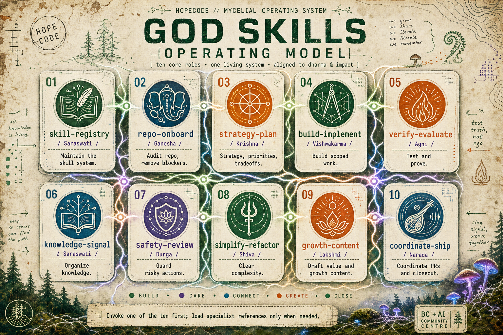
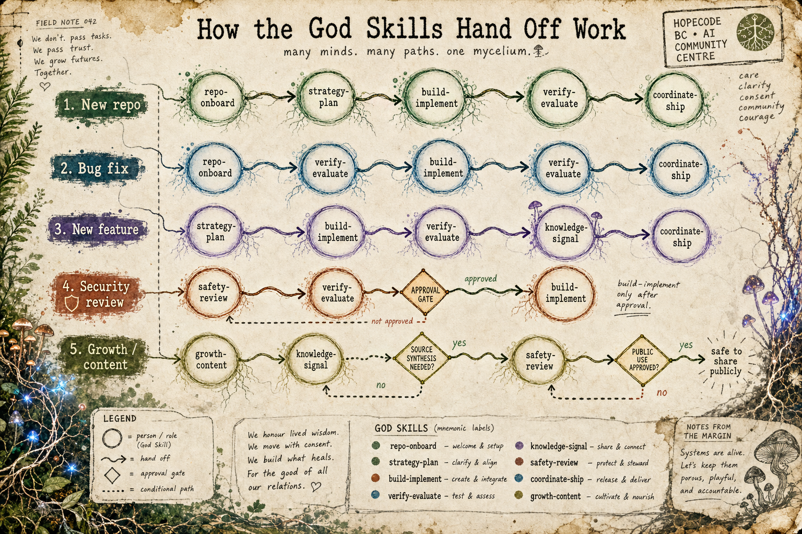
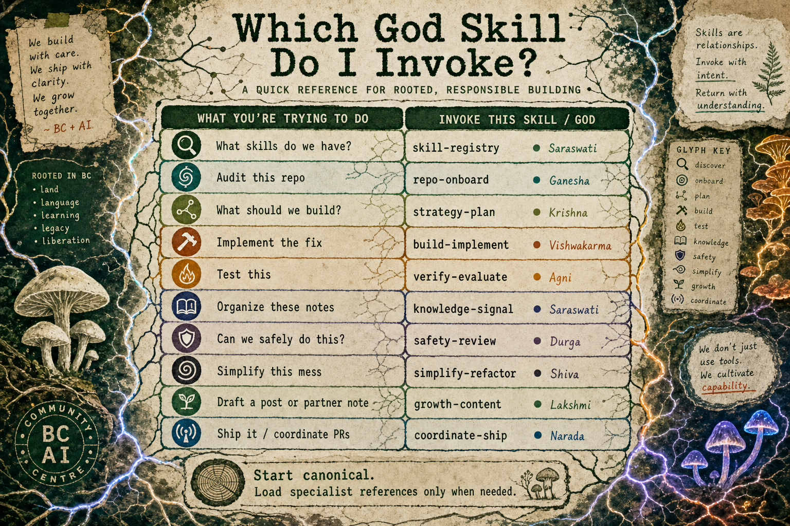
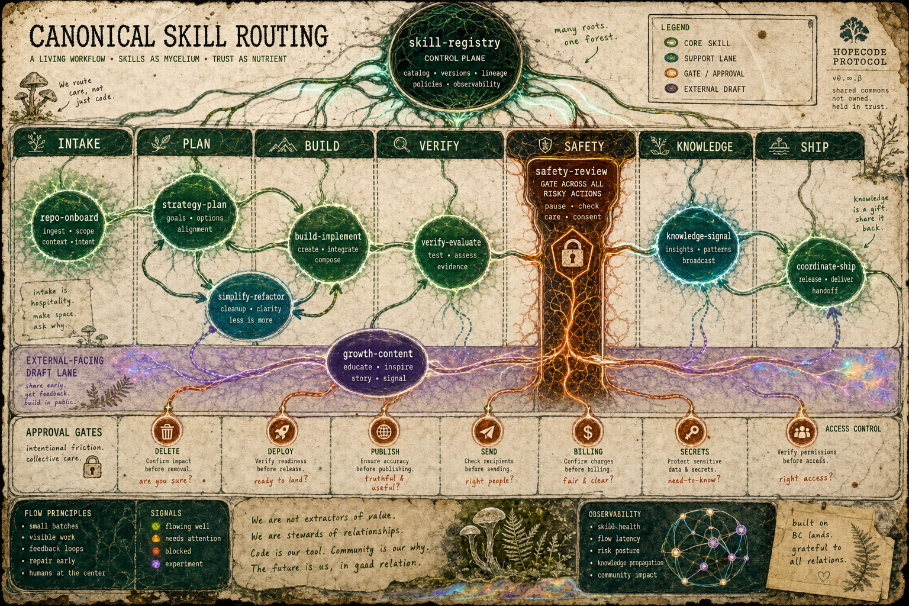
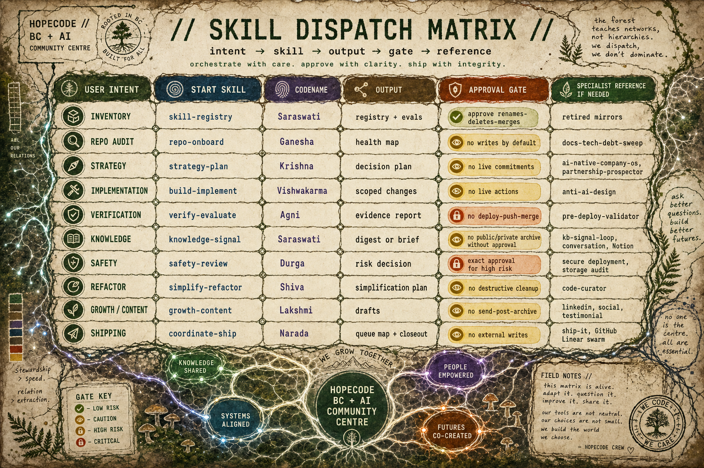

# Ask the Right Skill First: A Practical Guide to Agentic Workflows

At some point, "ask the AI" stopped being enough.

Not because the models got worse. The opposite. They got good enough that a sloppy request could produce something that looked finished. A plan. A draft. A pull request. A launch checklist. A social post. A thing with shape.

That is where the trouble starts.

When the output looks finished before the thinking is finished, you need a better operating model than vibes and prompt retries. You need a way to slow the work down in the right places, speed it up in the right places, and keep the human intent traceable as the work changes form.

This is the model I have been building toward: a set of canonical skills, explicit gates, and evidence loops. I call the visual system the God Skills operating model, but the work itself is very practical. It is a routing system for AI builders who want agents to help without turning the whole project into an enthusiastic mess.

It grew out of the same shop-floor work behind [BC + AI](https://bc-ai.ca/), [Both Hands Full](https://www.bothhandsfull.com/), [AI Keynote Slides Need Taste Before Prompts](https://kriskrug.co/2026/06/04/ai-keynote-slides-visual-workflow/), and the older [Punk Rock AI](https://kriskrug.co/2025/01/14/punk-rock-ai-a-manifesto-for-the-renegade-creators-of-tomorrow/) instinct: use the tools, keep your receipts, and do not let the machine flatten your taste.

## A Note On The Name

The Hindu names in these graphics are mnemonic codenames only. They are not religious claims, deity impersonations, parody, or a suggestion that software work is sacred in some grandiose way.

In public and in practice, the mechanical skill names do the real work: `repo-onboard`, `strategy-plan`, `build-implement`, `verify-evaluate`, and so on. The codenames are memory hooks I use to make the system easier to recall. The names should stay humble, respectful, and secondary to the operating discipline.

If that framing ever starts to feel like spectacle instead of stewardship, the public version should use the neutral phrase "canonical skills" and leave the mythology at the door.

## From Prompting To Operating

A prompt is a request.

A skill is a small contract.

It says:

- what kind of work belongs here
- what source material must be inspected first
- what output should exist when the work is done
- what actions are forbidden without approval
- which skill should receive the handoff next

That sounds simple, and that is the point. A useful agentic workflow does not need a giant orchestration platform before it becomes useful. It needs names, boundaries, and proof.

The Karpathy-style discipline matters here because it keeps the system from drifting into theatre:

- Think before coding.
- Keep the solution simple.
- Change only what the task requires.
- Define done before doing the work.

Those defaults are not glamorous. They are what stop an agent from turning a bug fix into a redesign, a draft into a publish action, or a repo audit into a pile of unrelated cleanup.

## What I Mean By A Skill

A skill is not a personality. It is not a mascot. It is not "the coding agent" wearing a different hat.

A skill is an operating mode with a trigger, a boundary, an output, and a handoff.

For example, `repo-onboard` does not exist to write code. It exists to understand the repo before anybody changes it. `verify-evaluate` does not exist to make the builder feel good. It exists to produce evidence. `safety-review` does not exist to say no to everything. It exists to separate reversible local work from public, destructive, private, or expensive actions.

That is the shift: stop asking one general assistant to improvise the whole job. Ask the right skill to do the next bounded part of the job.

The rule is:

> Start canonical. Load specialist references only when needed.

That keeps the loop small. A general canonical skill handles the first pass. If the work turns out to need a deeper playbook, then the agent loads a specialist reference. Not before. Not as ceremony. Only when it actually reduces risk or improves the result.

## The Ten Canonical Skills

Here is the current roster in plain mechanical terms.

| Skill | Codename | Use it when | Output |
|---|---|---|---|
| `skill-registry` | Saraswati | You need to understand or maintain the skill system itself. | Registry updates, routing rules, eval notes. |
| `repo-onboard` | Ganesha | You are landing in an unfamiliar repo or messy workspace. | Health map, source-of-truth paths, blockers. |
| `strategy-plan` | Krishna | The goal, tradeoffs, or success criteria are still unclear. | Decision plan, scope, assumptions, acceptance criteria. |
| `build-implement` | Vishwakarma | The goal is clear and the work is ready to build. | Scoped code, content, prompt, or workflow changes. |
| `verify-evaluate` | Agni | You need proof that the work behaves as intended. | Test results, smoke checks, evidence report. |
| `knowledge-signal` | Saraswati | Notes, docs, recaps, or source material need synthesis. | Digest, brief, source summary, reusable context. |
| `safety-review` | Durga | The work could publish, send, deploy, delete, expose, bill, or affect access. | Risk classification, approval gate, safest next step. |
| `simplify-refactor` | Shiva | The system is carrying avoidable complexity. | Simplification plan or narrow cleanup. |
| `growth-content` | Lakshmi | The output is public-facing, partner-facing, social, or value-oriented. | Draft copy, positioning options, approval notes. |
| `coordinate-ship` | Narada | The work needs PRs, issues, handoffs, queue mapping, or closeout. | Delivery map, PR notes, release or handoff summary. |

The roster is deliberately small. The point is not to create a skill for every mood. The point is to keep the first decision obvious enough that a human or agent can choose without disappearing into taxonomy.

## How The Skills Hand Off Work

The loop is not always linear, but the common paths are predictable.

For a new repo:

`repo-onboard -> strategy-plan -> build-implement -> verify-evaluate -> coordinate-ship`

For a bug fix:

`repo-onboard -> verify-evaluate -> build-implement -> verify-evaluate -> coordinate-ship`

For a new feature:

`strategy-plan -> build-implement -> verify-evaluate -> knowledge-signal -> coordinate-ship`

For a risky or public action:

`safety-review -> verify-evaluate -> build-implement only after approval`

For public-facing content:

`growth-content -> knowledge-signal when source synthesis is needed -> safety-review before public use`

That last one matters. A lot of AI workflow failures are not technical failures. They are boundary failures. The agent had enough capability to do the thing, but the system did not force the right question before the thing happened.

"Can we publish this?"

"Do we have consent?"

"Is this claim verified?"

"Are we about to overwrite something live?"

"Does this belong in public, or only in a local draft?"

The handoff map is how those questions stop being afterthoughts.

## How To Choose The Right Skill

The cheat sheet version is simple:

| If the request sounds like... | Start with... |
|---|---|
| "What skills do we have?" | `skill-registry` |
| "Audit this repo." | `repo-onboard` |
| "What should we build?" | `strategy-plan` |
| "Implement the fix." | `build-implement` |
| "Test this." | `verify-evaluate` |
| "Organize these notes." | `knowledge-signal` |
| "Can we safely do this?" | `safety-review` |
| "Simplify this mess." | `simplify-refactor` |
| "Draft a post or partner note." | `growth-content` |
| "Ship it." | `coordinate-ship` |

The important part is not that these exact names are perfect. They are not. The important part is that each name narrows the next move.

That narrowing is what makes the agent useful.

Without routing, the agent tries to be helpful in every direction at once. With routing, it has a job.

## Where The Engineering Discipline Shows Up

The skill system only works if the defaults are boring in the best way.

### Think Before Coding

Before writing, the agent should state assumptions and success criteria. That turns "fix the bug" into something measurable:

> Identify the failing behavior, trace the root cause, patch only that path, and prove the regression is gone.

It also turns "write a post" into something bounded:

> Create a local draft package with a post, SEO notes, alt text, internal links, and a publish gate. Do not publish.

The assumption step is not bureaucracy. It is how you catch scope creep while it is still cheap.

### Simplicity First

A skill should make the work smaller, not more ceremonial.

If a direct file edit solves the problem, do not invent a workflow engine. If a short checklist prevents the mistake, do not build a dashboard. If one source file is the truth, do not synthesize ten weaker signals.

The agentic loop should feel like a rail, not a maze.

### Surgical Changes

Good agents are dangerous when they are over-eager. They notice nearby problems. They want to tidy the whole room. They see a typo in one file, a stale comment in another, and suddenly the diff is no longer about the task.

The answer is not to make the agent less capable. The answer is to make the skill boundary explicit.

`build-implement` changes the scoped thing. `simplify-refactor` handles cleanup when cleanup is the task. `coordinate-ship` closes the loop without smuggling in unrelated work.

### Goal-Driven Execution

Done does not mean "the model produced an answer."

Done means the acceptance criteria are met. The local files exist. The tests pass. The smoke check returns the expected signal. The draft has a publish gate. The risky action has explicit approval or did not happen.

That is the evidence loop.

## What This Looks Like In Real Work

Here are a few sanitized examples.

### Starting In A Repo

The wrong move is to ask the agent to "look around and improve things."

That sounds productive, but it has no finish line.

The routed version starts with `repo-onboard`. The agent reads the repo instructions, checks the current state, finds the source-of-truth docs, identifies dirty work, and maps the likely entry points. Only then does `strategy-plan` decide what should happen next.

The output is not code. The output is orientation.

### Fixing A Bug

The wrong move is to jump straight to implementation because the symptom seems obvious.

The routed version starts by reproducing or locating evidence. `verify-evaluate` finds the failing assertion, broken route, bad screenshot, stale baseline, or smoke-check mismatch. Then `build-implement` patches the smallest path. Then `verify-evaluate` comes back to prove the behavior changed.

The loop is evidence before and after.

### Drafting Public Content

The wrong move is to let a model turn private notes into public copy in one pass.

The routed version starts with `knowledge-signal` if the source material needs synthesis, then `growth-content` for a draft, then `safety-review` before public use. That keeps the article grounded, prevents private details from leaking, and catches claims that need verification.

I wrote about a nearby creative version of this in [AI Keynote Slides Need Taste Before Prompts](https://kriskrug.co/2026/06/04/ai-keynote-slides-visual-workflow/): generation is not production, and selection is authorship. The same idea applies to agentic workflows. The draft is not the publish action. The patch is not the deploy. The plan is not the proof.

### Shipping Work

The wrong move is to treat "ship it" as a single action.

The routed version sends it to `coordinate-ship`: check the queue, preserve unrelated work, stage the right files, write the closeout, link the evidence, and stop before any push, merge, deploy, or publish action that has not been explicitly approved.

Shipping is not just movement. Shipping is accountable movement.

## The Gates That Keep The System Honest

The gates are where the system earns trust.

Some actions need exact approval:

- publish
- send
- deploy
- delete
- overwrite live content
- change secrets
- change billing
- change access control
- use private or testimonial material publicly
- make claims about live state without fresh verification

The point is not fear. The point is consent and reversibility.

A good agentic workflow should make low-risk work easy and high-risk work unmistakable. Local drafts, dry runs, smoke checks, and source summaries should move quickly. Public actions should pause, name the exact target, and wait for approval.

That distinction is how you get speed without pretending risk disappeared.

## The Dispatch Matrix

The dense version is for builders who want to adapt the model.

You do not need my exact names. You do not need my visual language. You do not need the codenames. You need the shape:

- a small canonical roster
- clear triggers
- explicit outputs
- approval gates
- specialist references loaded only when needed
- evidence before closeout

That is enough to start.

Pick five skills if ten feels like too much:

- onboard
- plan
- build
- verify
- ship

Then add safety before anything public or risky. Add knowledge when the system starts learning things worth preserving. Add growth/content when the output leaves the workshop and enters the world.

The names are less important than the behavior.

Ask the right skill first. Keep the loop small. Prove what changed. Leave the system easier to trust than you found it.

That is the whole game.
