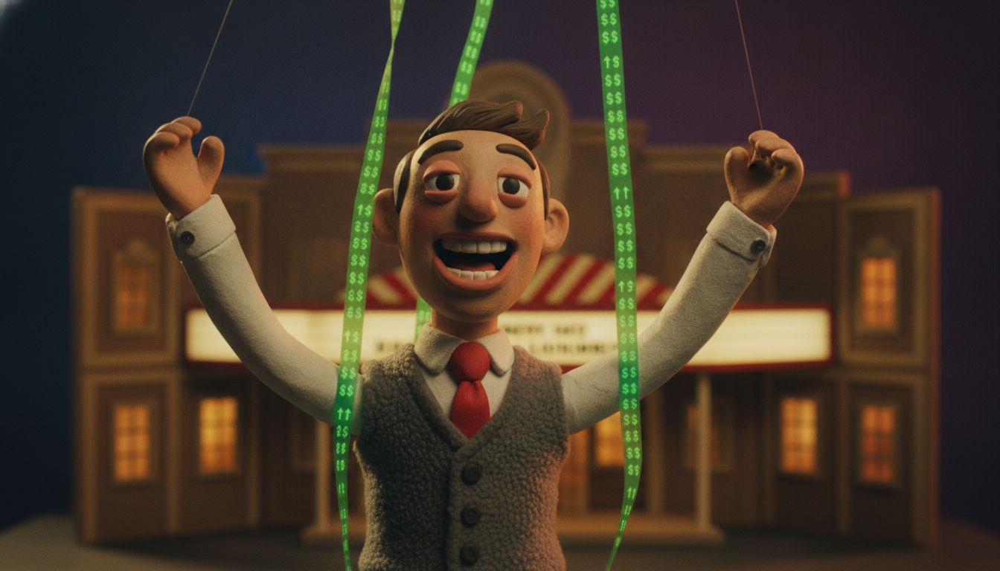
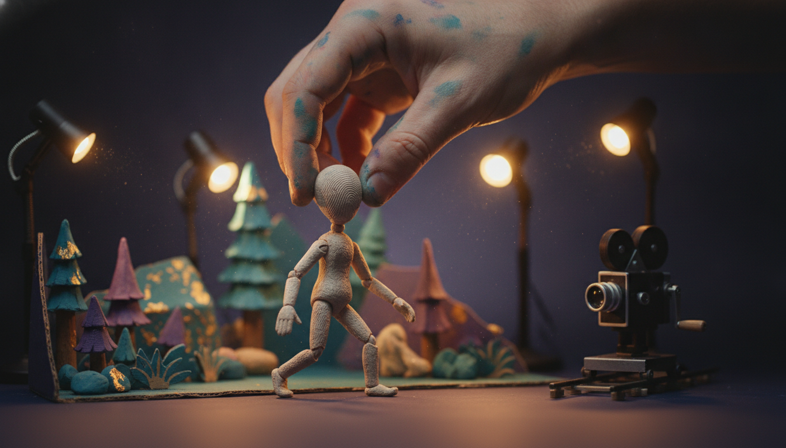

I watched [*The AI Doc: Or How I Became an Apocaloptimist*](https://www.focusfeatures.com/the-ai-doc-or-how-i-became-an-apocaloptimist) twice this week. Once for the movie, once with a notebook. And the thing I can't stop chewing on isn't the doom.

It's who was smiling.

The film is gorgeous, honestly made, and worth your two hours. Hold that thought. I'll come back to it.

But here's the pattern I couldn't unsee. The people in this movie who are most sure it's all going to be fine, the ones handing you that warm buckle-up-abundance-is-coming energy, are almost exactly the people with the biggest bets on it going up.

The cheer is a cap table. The mood of this movie has a shareholder list.

Follow the money and the mood follows it.

Here's the trailer if you haven't seen it:

https://www.youtube.com/watch?v=xkPbV3IRe4Y

## Reid Hoffman Is Reading You His Book

Start with Reid Hoffman.

In the film he's calm and reasonable and optimistic about our AI future. He's also, [per Forbes](https://www.forbes.com/profile/reid-hoffman/), worth about three billion dollars, and a big slice of that is levered straight to AI going the way he says it will.

He co-founded Inflection AI. Microsoft paid something like 650 million dollars to license its tech and hire away most of its people. Through Greylock he's an investor in dozens of AI companies, Anthropic included. He wrote a book last year called *Superagency: What Could Possibly Go Right with Our AI Future.*

Here's my favorite receipt. In 2023 he [stepped off OpenAI's board](https://en.wikipedia.org/wiki/Reid_Hoffman) specifically to avoid the conflicts of interest between that seat and his AI investments.

The conflict was real enough to resign a board seat over. And now he's on my screen, in a documentary, telling me not to worry.

I'm not saying the man is lying. I'm saying he's a shareholder reading you his own book jacket, and the movie mostly just lets him.

## Peter Diamandis Is Buying the Story

Then there's Peter Diamandis, the abundance guy.

He runs a [500-million-dollar AI fund and a 600-million-dollar exponential-tech fund](https://www.diamandis.com/). That second one holds a piece of Figure, the humanoid robot company everyone's hyping. You don't have to dig for any of this. [His own newsletter brags about it](https://www.diamandis.com/blog/abundance-43-figure-vs-tesla). He sells a whole worldview to a paid mastermind of executives.

Fine. That's a point of view with a business model bolted to it, which describes half the internet, me included some days.

But this is the one that made me put the remote down. In March, right as this documentary was hitting theaters, Diamandis launched a [3.5 million dollar XPRIZE](https://fortune.com/2026/03/09/xprize-foundation-future-vision-xprize-peter-diamandis-films-scifi-ai-fears/) to reward filmmakers who portray AI as the hero instead of the villain.

Read that again.

One of the cheerful optimists in an AI documentary is running a multi-million-dollar bounty on the entire genre of AI storytelling, to make sure the stories come out sunny.

That's not a point of view. That's a marketing budget with a trophy taped to it.

## And Yeah, the Worried People Have an Angle Too

So nobody gets to knock this over: the doom side isn't clean either. The CEOs in the chairs, Altman and Hassabis and the Amodeis, obviously own the upside too, and they're very good at the we-take-this-incredibly-seriously voice that doubles as marketing. Safety institutes raise money on the size of the scare. Eliezer Yudkowsky's whole public existence is the alarm bell. [Techdirt went after this same film](https://www.techdirt.com/2026/04/02/the-ai-docs-falsehoods-and-false-balance/) from the other direction, for handing the doomers too much authority and calling it balance.

So this isn't optimists-lie-doomers-tell-the-truth. Everybody on that screen is holding something.

The point is narrower, and harder to wiggle out of. The specific position "relax, this fixes everything" is owned, overwhelmingly, by the people who own the equity. When the guy telling you the water is fine also sells the pool, you get to check the temperature yourself.

## Why the Movie Gets Away With It

The film isn't dumb and it isn't a puff piece. It works you honestly. And the frame it uses to work you is a baby.

The whole documentary is built around director Daniel Roher becoming a father. The official logline is literally "a father-to-be tries to figure out what is happening with all this AI insanity." The spine of the thing is him asking, over and over, am I making a mistake having a kid right now.

There's a moment where Tristan Harris says he knows people who work on AI risk who don't expect their kids to make it to high school. Sam Altman, a new dad himself, says he isn't scared for a kid to grow up with AI, then admits it unsettles him that his kid will never be smarter than it.

That stuff lands. I have a nervous system. It's supposed to land.

But watch what the frame does. It takes an enormous public question about power and labor and money and who decides, and it shrinks it down to will my baby be okay. Larry Lessig [said it better than I can](https://lessig.substack.com/p/review-the-ai-doc-or-how-i-became): the executives' reassurances have nothing to do with the most important problems the film itself raised. Mass unemployment doesn't care how you feel about your newborn.

A baby is the most disarming frame on earth. It's also the most comfortable frame you could hand to people selling comfort. You don't argue with a dad holding a car seat. You nod.

And notice who doesn't get to be the emotional center. The people doing the sharpest work in this film on power and real harm, Timnit Gebru, Emily Bender, Karen Hao, Deborah Raji, are mostly slotted in as commentary. The felt, personal, this-is-my-family story belongs to the guy holding the camera. Point of view is a choice. It always is.

There's one more flavor of this worth naming. The film has an accelerationist wing, including Guillaume Verdon, the ex-Google physicist behind the ["Beff Jezos" persona](https://www.forbes.com/sites/emilybaker-white/2023/12/01/who-is-basedbeffjezos-the-leader-of-effective-accelerationism-eacc/) who more or less founded the e/acc movement. That crowd likes to argue that slowing AI down is the real sin, because you'd be robbing some astronomical number of future humans of ever existing.

It sounds moral. It's really just growth math. It counts people the way a spreadsheet counts total addressable market. More is always better, and it never once asks whether those future humans get to be free, or just get to be customers. Population as inventory. I'm about as pro-human as it gets, and I still think a billion managed users isn't obviously a better world than a few million free people.

## The Softest Sell Is the One I Loved

And then there's the part I genuinely loved, which is also, I think, the sneakiest sell in the whole thing.

The animation.

The film is full of handmade stop-motion. Real clay, real little sets, moved one frame at a time. Co-director Charlie Tyrell has said he wanted the look to be [antithetical to the digital space of AI](https://variety.com/2026/film/news/sundance-ai-doc-1236641352/). Handmade on purpose. They rebuilt Roher's actual backyard studio shack in Toronto to shoot it and cranked out something like fifteen minutes of animation at four to seven seconds a day.

It's beautiful. Fingerprints in the clay. Warmth you can't fake, or at least warmth they chose not to fake.

Now look at that choice. Here's a movie whose whole gravity pulls toward AI being unstoppable and mostly great, and its makers wouldn't let AI touch a single frame of their own craft. They hand-carved the reassurance.

The medium is whispering humans still matter here while the content shrugs and says maybe they won't. If the technology is so good and so inevitable, why not trust it to animate your movie about how good and inevitable it is?

I'm not mad about it. I think it might be the most honest thing in the film, and they may not have meant it that way.

## Both Hands Full, at the Movies

So here's where I land, which is the same place I always land, because this era has apparently decided contradiction is its native file format.

Left hand: go watch it. Seriously. It's well made, the dread is real, the questions are real, and the craft is a gift. Curiosity isn't the enemy here.

Right hand: don't swallow the comfort just because it came served warm. When a film about the future talks itself into "it's gonna be okay," check the cap table before you exhale. Ask who made you feel better. Then ask what they own.

Apocaloptimism is a lovely word. It's also a mood you can afford when you're long the stock.

Watch the movie. Keep both hands full. And don't buy reassurance from the people holding the shares.

## Related

- [Both Hands Full](https://kriskrug.co/2026/01/24/both-hands-full/)
- [Punk Rock AI](https://kriskrug.co/2026/05/04/punk-rock-ai/)
- [BC + AI Ecosystem](https://bc-ai.ca/)
- [Book Kris for a talk or a panel](https://kriskrug.co/contact/)

*Written after watching* The AI Doc: Or How I Became an Apocaloptimist *(Focus Features, 2026) twice, while prepping for a panel. Receipts linked inline.*
