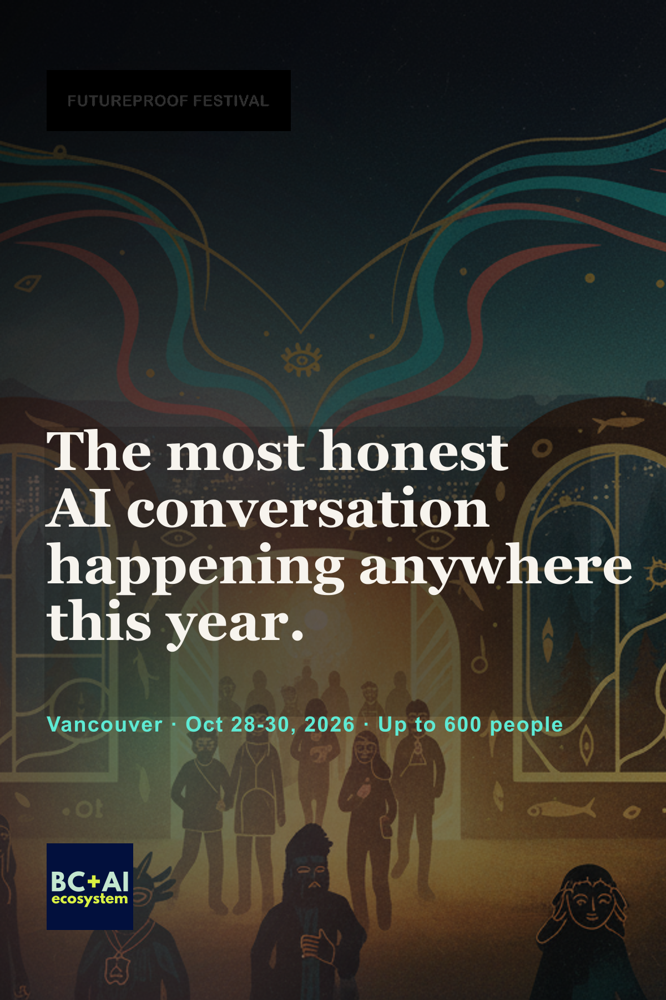

The baby is here.

**[Futureproof Festival](https://futureproof.website/).** October 28-30, 2026. [H.R. MacMillan Space Centre](https://www.hrmacmillanspacecentre.com/), Vancouver. Presented by [BC + AI](https://bc-ai.ca/).

>>> The most honest AI conversation happening anywhere this year. No hype. No panic.

I have long dreamt of an avant-garde festival of the future.

Not another conference with a logo wall and a tote bag. A room where art, technology, business, ethics, film, music, and the gloriously unclassifiable local weirdos could collide on purpose. A place where people with both hands full could sit beside each other without picking a team. Builders who ship. Artists who refuse to be a lunchtime slot. Educators, founders, skeptics, policy people, students, and the person in the back row who came alone and leaves with collaborators.

I wanted beautiful rooms and weird demos and proper talks. I wanted the hallway confession to matter as much as the keynote. I wanted a temporary culture, not a content calendar with lanyards.

For years that dream kept changing jackets. Futureproof Creatives. FITAL. Fatal Festival. Then [FATALE](https://fatalefestival.com/), the Future of Art, Technology and Alternative Living Experiment. Same voltage. Different label on the jar. I wrote about that long road in [*The Long Road to Futureproof*](https://kriskrug.co/2026/06/01/long-road-to-futureproof/). The itch never left. The city just needed time to grow a community that could hold it.

And then Vancouver caught up to the dream.

## I didn't start these meetups to start a meetup

I started [Vancouver AI](https://vancouver.ai/) because I needed a room before I could ask anyone to take a bigger swing. Trust before the festival. Community before the stage. You cannot summon a founding festival out of a cold Slack invite. You stack Thursday nights until the scene can see itself.

So we stacked. The meetups became working groups. The working groups became film nights, ethics labs, hackathons, office hours, artist experiments, and late-night planning docs with too many tabs open. People stayed to put chairs away. People brought better questions than the ones on the slide deck. Then [BC + AI](https://bc-ai.ca/) became the nonprofit container. Paperwork is where good ideas go to either become real or die of neglect. We chose real.

Receipts, since people ask: 250+ members. 3,000+ attendees. 94+ events across the [BC + AI calendar](https://bc-ai.ca/events). That is the soil. Futureproof is the next body growing out of it.

And the Space Centre? That one lands personal. I've spent more than a decade photographing rooms where people arrive as one version of themselves and leave a little rewired. TED stages. Olympic floors. Festival green rooms. You learn fast which venues are rentals and which ones are home. Putting Futureproof under that planetarium dome, with the Pacific right there and the city lit up outside, is not a flex. It's the room finally matching the idea. I sketched pieces of this future-festival itch years ago in [*Future Proof: Inside Vancouver's AI Ecosystem*](https://kriskrug.co/2024/10/10/future-proof-inside-vancouvers-thriving-ai-ecosystem/). Now the dates are real. One opening night. Two program days. A focused founding edition, not the week-long fever dream still waiting on the long arc.

## What Futureproof actually is

[Futureproof](https://futureproof.website/) is a festival, not a conference.

AI is too weird, too powerful, too intimate, and too everywhere to leave inside the usual conference lanes. Builders need artists in the room before the interface is baked. Teachers and students need a real seat. Public-interest people and startup people need to talk without everyone performing their assigned costume. Indigenous governance, creative rights, labour, climate, computation, film, music, education, and business already overlap in real life. The event should admit that.

So the shape is listening, making, and experiencing. Critique in one hand, curiosity in the other. Both hands full. The same stance I've been arguing in public for years: we use this stuff, and we refuse to pretend the costs are somebody else's problem.

Public line, and I mean it: the most honest AI conversation happening anywhere this year. No hype. No panic.

Tagline: **Build what lasts.**

The world does not need Vancouver to mimic San Francisco with better mountains. We win if we build rooms that make better questions normal. We win if artists have power in the conversation beyond a cute performance slot after lunch. We win if the people affected by AI get a voice before the systems harden. That is the non-extractive piece. That is the part I do not want sanded off by conference logic.

[[GALLERY-MANIFESTO]]

## Who's already in the room

The [public speaker lineup](https://www.futureproof.website/speakers/) is live, and it keeps growing. These are the people cleared and announced so far. Read their profiles. Show up ready to talk with them, not at them.

- [Amber Case](https://www.futureproof.website/speakers/amber-case/), Founder, [Calm Tech Institute](https://calmtech.com/)
- [Ana Serrano](https://www.futureproof.website/speakers/ana-serrano/), President & Vice-Chancellor, [OCAD University](https://www.ocadu.ca/)
- [Lynda Brown-Ganzert](https://www.futureproof.website/speakers/lynda-brown-ganzert/), CEO, [RxPx Inc](https://rxpx.health/)
- [Zaro](https://www.futureproof.website/speakers/gabe-zaro/), Community Intelligence Architect, [zaro.me](https://www.zaro.me/)
- [Mayumi Rollings](https://www.futureproof.website/speakers/mayumi-rollings/), Founder & CEO, [Tiny Ghost Studios](https://tinyghoststudios.com/)
- [Anthonia Ogundele](https://www.futureproof.website/speakers/anthonia-ogundele/), Founder & Executive Director, [Ethọ́s Lab](https://ethoslab.ca/)
- [Kaoru Yoshihira](https://www.futureproof.website/speakers/kaoru-yoshihira/), Head of Partner Development, [BytePlus](https://www.byteplus.com/)
- [Peter Bittner](https://www.futureproof.website/speakers/peter-bittner/), AI Trainer & Consultant, [The AI Upgrade](https://theupgrade.ai/)

More to come. Watch the [speakers page](https://www.futureproof.website/speakers/). If your name belongs in that room and it is not there yet, the [Call for Talks](https://www.futureproof.website/call-for-talks/) exists for a reason.

## The bat signal

I've been on the internet for 28 years. This is my third trip around the sun with this community in its current form. If we've built something together, if you've sat in a meetup, stacked chairs, argued with me in a hallway, taught a workshop, sponsored a night, photographed a room, opened with ceremony, or just kept showing up when the room was still half empty, this is the call.

>>> Converge on Vancouver in October. Bring your better questions.

I am not asking you to attend a product launch with better lighting. I am asking you to help make a founding room that can hold honesty without collapsing into hype or panic. That only works if the people who already know how to build culture here actually show up.

## Come make it real

Start here:

- [RSVP on Luma](https://luma.com/futureproof-festival)
- [Earlyworm pass](https://www.futureproof.website/tickets/) is CA$650. Priority ends August 15.
- [Call for Talks](https://www.futureproof.website/call-for-talks/) priority closes July 31. If you've got something honest to put on a stage, put it in.
- Want to sponsor or exhibit? Start on the [tickets](https://www.futureproof.website/tickets/) page and find us through [BC + AI](https://bc-ai.ca/) and the [events calendar](https://bc-ai.ca/events).

The site is up. The room is booked. The community is real. The baby is here.

**[Build what lasts.](https://futureproof.website/)**
