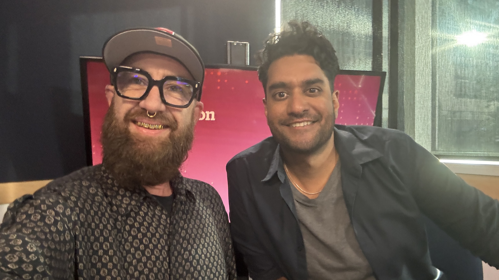

# Both Hands on the Power Cord: AI, Energy and Who Gets Canada's Future

## AI, protest, and who gets Canada's future

I marched through Vancouver in a crowd chanting “Fuck AI.”

Then I went home and used AI to organize my notes.

That is not a confession. It is not a gotcha. It is the most honest sentence I know how to write about this moment.

I run [BC + AI](https://bc-ai.ca/). I teach people how to use these tools without sanding off their judgment. I have watched AI make small creative crews capable of work that would have taken a studio a few years ago. I have also stood beside artists, students, engineers, and kids carrying signs about stolen work, brain rot, water, jobs, and data centres nobody asked for.

They are right about a lot of it.

The people selling frictionless abundance are right about some things too. The tools are useful. The capabilities are real. Retreat does not un-invent them.

So I keep walking with both hands full.

Critique in one hand. Curiosity in the other. No empty hand available for a pom-pom or a pitchfork.

## Hear the BC Day conversation

On August 3, Jason D'Souza spoke with me on [CBC's *The Early Edition*](https://www.cbc.ca/listen/live-radio/1-91-the-early-edition/clip/16229723-local-ai-leader-explains-provinces-tech-community-responding) about how British Columbia's tech community is responding to the federal AI strategy.

*Kris Krüg with interviewer Jason D'Souza at CBC Vancouver after their BC Day conversation. Photo: Kris Krüg.*

<audio controls preload="metadata" src="https://mp3.cbc.ca/radio/2026/08/03/dave-JlqWqynA-20260803.mp3"></audio>

*Kris Krüg on CBC's The Early Edition, August 3, 2026 (7:48). [Listen on CBC](https://www.cbc.ca/listen/live-radio/1-91-the-early-edition/clip/16229723-local-ai-leader-explains-provinces-tech-community-responding).*

## Watch the Power Struggle conversation

https://www.youtube.com/watch?v=n_aGBFGnPzo

*Originally produced by [Power Struggle](https://www.youtube.com/watch?v=UzJfMJzkFwc) and hosted by Stewart Muir. Republished on my channel with permission. You can find more playable interviews and broadcasts on my [Media Appearances](https://kriskrug.co/2026/07/02/ai-media-appearances-podcast-guesting/) page.*

When Stewart invited me onto *Power Struggle*, we started with Vancouver's grassroots AI community, my trip from photography into generative systems, and the weird little laboratories where people are learning this stuff together.

Every road led back to electricity.

AI looks like software until you find the power cord. Follow the cord and the whole argument changes shape. You find dams, gas, copper, transmission lines, cooling systems, land-use hearings, capital stacks, host Nations, ratepayers, and windowless buildings that arrive with a jobs promise and an NDA.

The chatbot is the puppet. The grid is the hand.

## Power is doing double duty

Stewart's show has the right name.

This is a struggle over electrical power: who can generate it, who can buy it, what gets connected first, and who pays when a giant new load shows up.

It is also a struggle over political power: who knows the deal is happening, who gets to negotiate, who owns the infrastructure, who governs the data, and who is expected to smile for the ribbon cutting.

Those two meanings now sit on top of each other.

The [International Energy Agency](https://www.iea.org/reports/energy-and-ai/executive-summary) expects global data-centre electricity use to more than double to roughly 945 terawatt-hours by 2030. Canada says its commercial AI sector could need [5.5 gigawatts of compute capacity by 2030](https://ised-isde.canada.ca/site/ised/en/canadas-national-artificial-intelligence-strategy-ai-all).

These are industrial numbers. They do not belong inside a story about smarter email.

That does not mean every giant forecast deserves worship. A proposed five-gigawatt campus is not using five gigawatts today. Nameplate capacity is not annual energy. A hydro dam, a gas plant, a battery, and a server hall do different things on different timelines. Giant numbers are often used the way smoke machines are used at concerts: to make the entrance feel inevitable.

Still, the direction is obvious. AI is heavy industry now.

The question is not whether Canada has electricity. The question is what we are willing to trade for the thing plugged into it.

## The Canadian special, now with tokens

Canada knows how to export the cheap part.

We cut the log, ship it out, and buy back the table. We pull the resource from the ground, move it across a border, and watch somebody else keep the intellectual property, the companies, and the durable wealth.

The digital version is easy to picture. We supply land, water, electricity, tax incentives, and a polite press conference. A foreign-owned server farm runs here. The useful intelligence, the model ownership, the cloud margin, and the decisions live somewhere else. Canadian builders rent access by the token.

We keep the power bill.

That is not sovereignty. It is the raw-log economy with better air conditioning.

Canada's [Sovereign AI Compute Strategy](https://ised-isde.canada.ca/site/ised/en/canadian-sovereign-ai-compute-strategy) at least names the need for domestic capacity and access. Good. But a rack on Canadian soil is not sovereign because somebody stuck a maple leaf on the door.

Sovereignty has to show up in the cap table, the contracts, the governing law, the data rights, the intellectual property, the price of access, and the ability to keep operating when a foreign company changes the terms.

The cheer is a cap table. So is the grid.

Watch who is smiling. Then look at what they own.

## The protest is not outside the process

At the Vancouver marches, I photographed the signs and listened to the chants.

“People need water, not AI.”

“AI art is not art.”

“Use your brain.”

“No data centres.”

Every chant is a real argument compressed until it can survive traffic.

Some of the compression breaks the argument. “Use your brain, not AI” does not make much more sense than “use your brain, not a calculator.” “No data centres anywhere” can push the same infrastructure toward the community with the least money, the weakest labour protections, and the smallest chance of saying no.

But dismissing the signs because they are not policy papers misses what protest is for.

The protesters are dragging power into public.

They are forcing cities to hold meetings that should have happened before the deal. They are making reporters ask about water, electricity rates, permanent jobs, consent, and ownership. They are turning the smooth private language of “investment” into the rough public question: investment for whom?

In [Both Hands on the Grid](https://bc-ai.ca/news/both-hands-on-the-grid), I wrote about Menomonie, Wisconsin, where residents faced a $1.6-billion data-centre proposal fronted by a shell company. They organized, stopped the rezoning, and then built a toolkit so the next town would not have to start from zero.

That is not fear of the future. That is civic infrastructure.

The useful position is not “never.”

It is “not like this.”

Not in secret. Not with public officials gagged by NDAs. Not with a jobs number that disappears after construction. Not with ratepayers quietly carrying the grid upgrade. Not with host Nations invited after the capital stack is finished. Not with the water number hidden behind a sustainability page full of leaves.

Protest is not the opposite of participation. Sometimes it is the first honest part of it.

## Both hands full is not the mushy middle

People hear “both hands full” and imagine compromise. Split the difference. Sand off the sharp edges. Everybody gets half a sandwich.

No.

This is not centrism. It is a refusal to become simple because the moment is complicated.

One hand holds the full critique: non-consensual training data, disappearing junior work, concentrated ownership, bias laundered as math, water, power, land, surveillance, dependency, and a political process designed to exhaust anyone without a government-relations budget.

The other hand holds the full capability: medical research, accessibility, language work, wildfire detection, climate modelling, creative tools, small teams shipping real things, and people learning faster than the old institutions can teach them.

Neither hand cancels the other.

I do not want less critique so I can keep building. I want critique close enough to the build that it changes the wiring.

I do not want less curiosity so I can keep my activist credentials clean. I want enough practical knowledge to tell a real alternative from a nice poster.

That is why I can march on Saturday and build on Monday. The march tells the build what it owes. The build gives the march something more durable than refusal.

Somebody has to stand outside with the sign.

Somebody has to sit inside with the contract.

Some of us are going to move between both rooms carrying messages.

## The grid is a political document

British Columbia has a real advantage: mostly clean electricity, a cool climate, strong research, creative and technical talent, and a Pacific position that central Canada treats like decorative whitespace.

It also has limits.

BC has created a competitive allocation of [300 megawatts for AI projects and 100 megawatts for other data centres](https://archive.news.gov.bc.ca/releases/news_releases_2024-2028/2025ECS0044-001032.htm). The stated goal is to choose projects that produce the greatest benefit for British Columbians.

Good. Now put “benefit” in writing.

Who owns the facility?

Who paid for the transmission?

Which laws govern the data?

How much affordable compute stays available to local researchers, artists, public institutions, small businesses, and community organizations?

What intellectual property stays here?

How many permanent jobs exist after the cranes leave?

Who carries the water, land, carbon, and ratepayer risk?

What happens when the anchor customer changes its mind?

Megawatts are an input. Public benefit is the outcome.

The grid tells us what government has decided matters. Every connection is a priority wearing copper.

## Sovereign for whom?

The word “sovereign” is getting stretched until it means “located nearby.”

That is not enough.

Infrastructure on Indigenous lands cannot become another round of consultation theatre. If a project touches a Nation's territory, ownership, governance, land authority, procurement, employment, and revenue belong at the beginning.

So does data.

The First Nations principles of [OCAP](https://fnigc.ca/ocap-training/) stand for ownership, control, access, and possession. They are not a decorative paragraph for a national compute strategy. They are a working answer to a question the rest of the technology industry is only starting to ask: what does it mean for a people to govern the information about them?

I have learned a lot of this through my work with Carol Anne Hilton and the Indigenomics crew. The lesson is not “include Indigenous people in our plan.” The lesson is that the plan changes when the people carrying land, law, memory, and economic authority are architects instead of late-stage consultees.

A Canadian compute layer built on Indigenous territories and fed by Indigenous data is not sovereign if the Nations involved hold no real authority.

Seven generations of consent, not two weeks of online comment.

## Put the receipts in the deal

I do not want another statement of principles. I want terms.

Here is the start of a deal I could stand behind:

1. **A public compute registry.** Large facilities disclose ownership, power source, carbon intensity, water use, waste heat, grid costs, permanent employment, subsidies, and community agreements. No registry, no interconnection.

2. **Make the load pay for the load.** A household should not quietly subsidize a hyperscaler's connection. New generation, transmission, storage, and demand-response obligations belong in the project economics.

3. **Indigenous ownership and governance from day one.** Board seats, equity, land authority, revenue, procurement, and data governance are structural terms, not late-stage benefit crumbs.

4. **A public-interest compute allocation.** Reserve affordable capacity for researchers, small Canadian builders, public institutions, artists, educators, community organizations, and Indigenous governments. A public compute strategy that only incumbents can navigate is a private club with a flag on it.

5. **No secret owner and no civic NDA.** A council should never vote on a project whose real counterparty the public cannot name.

6. **Measure what stays.** Every announcement should state the Canadian ownership, permanent jobs, local procurement, intellectual property, public capacity, and community revenue expected to remain after the construction crews leave.

This is not anti-business.

It is business with the bill paid and the ownership disclosed.

## Build the alternative

The boosters offer inevitability.

The doomers offer refusal.

Both positions let us off the hook.

I do not believe the future is an incoming weather system. I believe it is a set of choices hidden inside contracts, zoning meetings, model licences, utility queues, classrooms, studios, and server rooms.

The fight is not “AI or no AI.”

The fight is whether we become a power source for somebody else's intelligence economy or build a capacity that our own people can govern and use.

I want clean, accountable compute in British Columbia. I want Nations holding equity and authority. I want creators paid instead of scraped and scolded. I want public-interest builders to get GPU hours without first convincing a venture capitalist that civic life is a total addressable market. I want small crews of beautiful weirdos making things nobody in Palo Alto would approve.

I want the machines.

I want them badly enough to insist that we build them right.

That means marching when the deal is rotten. It means staying at the table when walking away would hand the pen to somebody worse. It means checking the cap table when the reassurance arrives warm. It means putting the receipts where the adjectives used to be.

Both hands full.

One on the sign.

One on the power cord.

Pull if we have to. Rewire whenever we can.

---

*Kris Krüg is a photographer, creative technologist, community builder, and Executive Director of the [BC + AI Ecosystem Association](https://bc-ai.ca/). He works at the intersection of creative practice, public-interest technology, and the strange civic work of keeping humans in the loop.*
