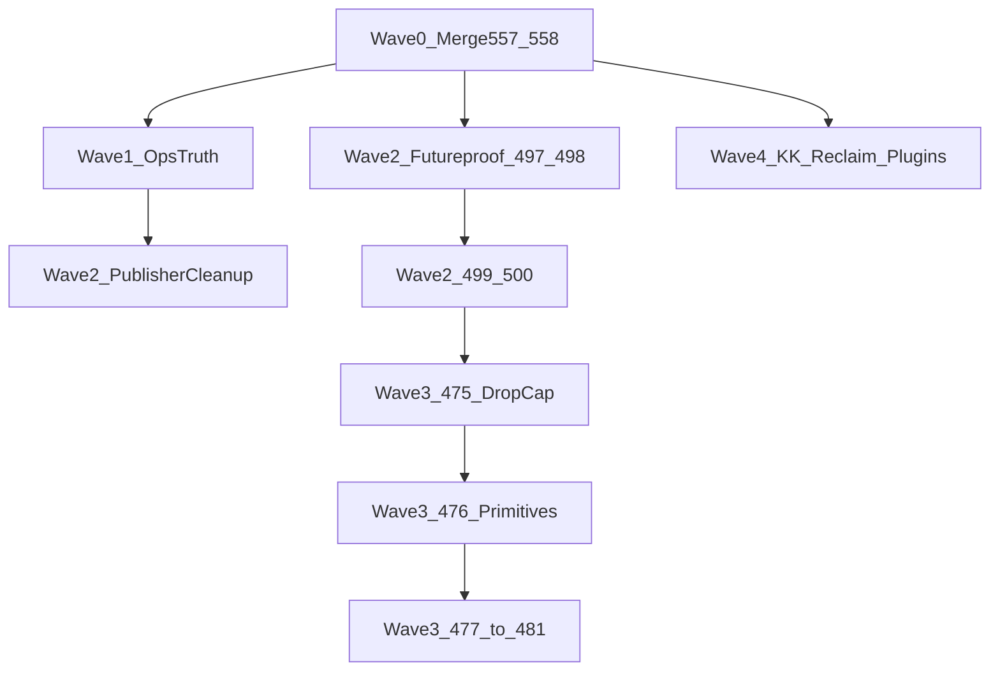

# Agentic Crush Plan — 2026-07-31

**Status:** SUPERSEDED 2026-08-23 by [`WORK-PLAN-2026-08-23.md`](WORK-PLAN-2026-08-23.md). Historical below; the PRs it lists have merged and the `agent-safe-merge` lane it assumes was deleted. Was: active execution plan (audit-backed). Supersedes day sequencing in older WORK-PLANs once Wave 0 lands; does **not** replace safety rules in `INCIDENT-2026-05-15-overwritten-post.md` or `TWO-TRACK-MODEL.md`.
**Lane rule:** one track per commit. Never interleave theme visual deltas with content publishes.
**Does not authorize** live WP writes, theme deploys, or `git filter-repo` without explicit KK approval.

Sibling truth/reclaim PRs (already open, CI green, labeled `agent-safe-merge`):

| PR | What | Blocker |
|---|---|---|
| [#557](https://github.com/WalksWithASwagger/kriskrug-wp/pull/557) | Front door 2026-07-30 + #549 May–June archive | `AGENT_MERGE_TOKEN` missing; Cloud App cannot approve |
| [#558](https://github.com/WalksWithASwagger/kriskrug-wp/pull/558) | #369 reclaim A+D (~212 MB) | Same |

---

## Audit snapshot (2026-07-31)

### Live vs `main`

| Signal | Live / observed | Declared on `main` |
|---|---|---|
| Aurora | **1.5.0** | style.css **1.5.0**; CURRENT-STATE-07-16 still contradicts (repo 1.4.9 / #493 open) |
| WordPress | **7.0.2** | OK |
| Open PRs | **3** (#556–#558) | Declared **0** → permanent drift noise |
| Open issues | **43** | Declared **77** |
| `/llms.txt` | **200** (= `fixes/llms.txt`) | `FIX_QUEUE` still claims 404 |
| WP smoke | 0 fail / 0 warn | — |
| Draft queue | unavailable without creds | Declared 5/64/4 (stale auth shape) |

### Bloat

| Path | Size | Notes |
|---|---:|---|
| `.git` | ~352 MB | Shrink only via KK-gated Phase C rewrite |
| `content/drafts` | ~243 MB | #558 removes ~189 MB published `images/` |
| `docs/current-state` | ~34 MB | ~24 MB report PNGs in #558; 119 top-level `.md` until #557 |
| `content/source-packs` | ~39 MB | keynotes verification ~32 MB — later reclaim |
| `backup/` | ~20 MB | Tier 3; KK confirm rollback refs |
| Tracked files >1 MB | 104 / ~250 MB | Dominated by draft images |

### Bugs / false signals (real)

1. **Front door lies** — AGENTS/Makefile/README/INDEX still pin WORK-PLAN/CURRENT-STATE **07-16**; three “active” July work plans compete; #557 already fixes this.
2. **CHANGELOG 1.5.0** still says PR #493 “still unmerged” / #545 open — tiny theme-path follow-up after #557.
3. **`create_local_wp_draft.py` hard-requires WP creds even for `--dry-run`** — blocks Cloud Futureproof dry-runs without secrets.
4. **Broken relative links** — e.g. GSC cleanup → `../fixes/` (wrong); morning-truth links pointing at archived filenames without `archive/`.
5. **Stale issue labels** — closed #474 still `blocked`; #476+ both `swarm-ready` and `blocked`; #423 still titled DECISION; #416 still OPEN after PR #505 shipped.
6. **Rebuild plan inconsistency** — #127 dependency wording vs #479 breakpoints step.
7. **Drop-cap still live** — forces Track A page-content `!important` CSS (#480) until #475.
8. **Editor/front CSS divergence** — until #476.
9. **Parked plugins look “real”** — `kk-sidebar-promos`, `kk-marquee-board`, `inc/digital-composting.php` not live (404 / no CPT).
10. **IndexNow** — not implemented on `main` (laptop WIP only); do not invent deploy without KK.
11. **`agent-safe-merge` workflow broken** without Actions secret `AGENT_MERGE_TOKEN`.
12. **CI gap** — `theme-smoke` in `make test` but not in PR CI; no CI for live-parity / visual / seo-publisher-smoke.

### What is *not* the day backlog

- `FIX_QUEUE.md`, May `ROADMAP.md`, Catch Responsive items — archaeology.
- `.github/agents/` swarm — parked.
- Page redesign epic #403 cluster — product decisions after layers, not hygiene.

---

## Success criteria (crush done when)

- [ ] #557 + #558 merged; `main` front door is 2026-07-30 (or newer); morning-truth drift clean on PRs/issues/WP/theme
- [ ] Issue labels match dependency reality; #423 retitled; #416 residual closed or annotated
- [ ] Futureproof #496–#500 staged as unpublished WP draft (KK-reviewed)
- [ ] Aurora **#475 → 1.5.1** landed + pixel-gated; then #476 queued
- [ ] Shipped `publish_*.py` one-offs archived; `create_local_wp_draft` dry-run works without creds for package validation
- [ ] Fixes disposition doc matches live (llms/robots); parked plugins explicitly go/no-go
- [ ] No new tracked draft `images/` (gitignore from #558); optional Wave-C reclaim for source-packs/backup after KK
- [ ] `AGENT_MERGE_TOKEN` + Cloud `GH_TOKEN` set so agents can finish docs/content merges without UI babysitting

---

## Wave 0 — Unblock the factory (KK, minutes)

**Owner: KK.** Agents cannot proceed past branch protection without this.

1. Squash-merge **[#557](https://github.com/WalksWithASwagger/kriskrug-wp/pull/557)** then **[#558](https://github.com/WalksWithASwagger/kriskrug-wp/pull/558)** in the GitHub UI  
   **or** add classic PAT as Actions secret `AGENT_MERGE_TOKEN` + Cursor Cloud secret `GH_TOKEN` (same value), then re-run *Agent safe merge* for `557` then `558`.
2. Paste Phase 3 issue hygiene from `docs/current-state/reports/phase-3-hygiene-20260730.md` (on #557) — or re-run after merge:
   - retitle #423 → Path A epic
   - remove `blocked` from closed #474
   - remove `swarm-ready` from #476–#481/#424 while still blocked
   - label #369 `tech-debt` + `priority:medium`
3. Optional: merge or close Dependabot [#556](https://github.com/WalksWithASwagger/kriskrug-wp/pull/556) on its own merit.

**Done when:** `main` has CURRENT-STATE/WORK-PLAN/MASTER-PLAN 2026-07-30; reclaim A+D deleted; `make status-readonly` drift clean for open PRs/issues/WP version.

---

## Wave 1 — Ops truth + small bugs (agent-safe, parallel)

Run as separate docs/ops PRs after Wave 0. No live WP. No theme CSS.

| ID | Package | Goal | Files | Gate |
|---|---|---|---|---|
| **W1a** | CHANGELOG 1.5.0 | Fix “#493 still unmerged” line | `theme/kk-aurora/CHANGELOG.md` | Human merge (touches `theme/`) |
| **W1b** | Root docs residue | Scrub root `README.md` / remaining `docs/*.md` parked banners (`architecture`, `automation-guide`, `cloudways-*`, `vision`, `roadmap`) → `docs/archive/` or STATUS banners | `docs/`, `README.md` | agent-safe-merge |
| **W1c** | Fixes live disposition | Rewrite one short disposition: llms/robots live; news-sitemap draft; IndexNow = not on main | `docs/current-state/` | agent-safe-merge |
| **W1d** | Link repair | Fix broken `../fixes/` and archive-relative links left after #549 | docs that still point wrong | agent-safe-merge |
| **W1e** | CI tighten | Add `theme-smoke` to PR CI; group Makefile help (docs only if needed) | `.github/workflows/test-pr.yml` | CI green |
| **W1f** | Close false opens | Annotate/close #416 residual (shipped #505); comment #495 swarm board stale vs this plan | GitHub issues | KK/token for close |

**Parallelizable:** W1b ‖ W1c ‖ W1d ‖ W1e. W1a alone (theme path).

---

## Wave 2 — Track A content (Publisher agents)

Prefer `scripts/notion-to-wp/create_local_wp_draft.py`. No new `publish_*.py`. Dry-run → slug-match → draft-only.

| ID | Package | Goal | Gate |
|---|---|---|---|
| **W2a** | Futureproof #497 | Stage design assets + alt text | agent-safe; no WP write |
| **W2b** | Futureproof #498 | Public speaker lineup verify/assemble | needs-human-review; embargo rules |
| **W2c** | Futureproof #499 | Write story in KK voice | after W2a+W2b; human review |
| **W2d** | Futureproof #500 | `create_local_wp_draft` → unpublished WP draft | **WP creds**; never `--publish` |
| **W2e** | Publisher dry-run soft-deps | Allow package validation without WP when `--dry-run --offline` (or equivalent) | tests; no live write |
| **W2f** | Archive shipped one-offs | Move `publish_*.py` (shipped posts) to `scripts/notion-to-wp/archive/` | tests green |
| **W2g** | Laptop WIP triage | `no-one-knows…` / `the-unmakable…` / IndexNow — commit on content branch or drop | KK pick |

**Parallelizable:** W2a ‖ W2b. Then W2c → W2d. W2e ‖ W2f anytime after Wave 0.

**Do not start** homepage redesign #411–#415 / pages #418–#420 until Wave 3 drop-cap decision; copy-only packets OK if they do not fight page-content CSS.

---

## Wave 3 — Track B theme rebuild (Architect agents)

Per `AURORA-STYLESHEET-REBUILD-PLAN.md`. One PR per step. Pixel gate each deploy.

| ID | Issue | Version | Goal | Gate |
|---|---|---|---|---|
| **W3a** | #475 | **1.5.1** | `01-reset.css` + `03-base.css`; retire/opt-in drop cap | KK visual + pixel + KK deploy |
| **W3b** | #476 | **1.5.2** | Primitives + editor style parity | pixel + KK deploy; unblocks #424 |
| **W3c** | #477 | 1.5.3+ | Component migration, **one component per PR** | pixel each |
| **W3d** | #479 | — | 12 breakpoints → 3-step scale | can run beside W3c |
| **W3e** | #478 | 1.6.0 | Dead CSS delete; fold animations/bleeding-edge | after coverage |
| **W3f** | #480 | — | Retire six-route page-content CSS (Track A) | after W3a |
| **W3g** | #481 | 1.6.1 | Rename `aurora-`/`revive-`/`kkm-` → `kk-` | last |

**Hard rule:** no Track A publish batch mid-W3a (drop-cap is intentional visual delta).

---

## Wave 4 — Deeper reclaim + park decisions (KK-gated)

| ID | Package | Gate |
|---|---|---|
| **W4a** | Bucket B/C draft photos / unpublished images | Exact KK allow-list |
| **W4b** | `content/source-packs/keynotes-2026/verification/` (~32 MB) | KK spot-check |
| **W4c** | `backup/` age-out | Confirm no open rollback refs |
| **W4d** | `.git` Phase C `filter-repo` | Mirror + separate thread; never in normal PRs |
| **W4e** | Plugins go/no-go | Deploy `kk-marquee-board` / sidebar / digital-composting **or** archive with STATUS banner |
| **W4f** | Local disk `photos-raw/` (~560 MB if present) | Off-repo backup then delete locally — not a git PR |

---

## Agentic dispatch recipe

Paste to a fresh agent after Wave 0:

```text
Follow docs/current-state/AGENTIC-CRUSH-PLAN-2026-07-31.md.
1) Confirm Wave 0 done: make status-readonly; front door is CURRENT-STATE-2026-07-30.
2) Pick ONE package ID (W1* or W2* or W3*). Do not mix tracks.
3) Open cursor/<package>-6351 from main. Draft PR. One concern per commit.
4) No live WP write / theme deploy / filter-repo without explicit KK approval of the exact artifact.
5) Prefer create_local_wp_draft.py for content packets. Dry-run → slug-match → draft-only.
```

**Recommended crush order for maximum agent fan-out:**



---

## Explicit non-goals

- Rewriting May archaeology instead of archiving it (#557 already does the move)
- Deploying parked plugins without a product surface
- Inventing IndexNow as a secret “quick win”
- Mixing #475 CSS with Futureproof publish
- Treating green CI as auto-merge without review path

---

## Validation commands

```bash
make status-readonly
make docs-truth-check
make verify          # after code/theme packages
make check-live-parity
LOCAL_ONLY=1 make draft-queue-audit   # without creds
# with creds:
make draft-queue-audit
```

---

**Audit evidence date:** 2026-07-31. Re-run `make status-readonly` before each wave; if open PR/issue counts move, update CURRENT-STATE — do not invent new “active” work plans without retiring this one.
